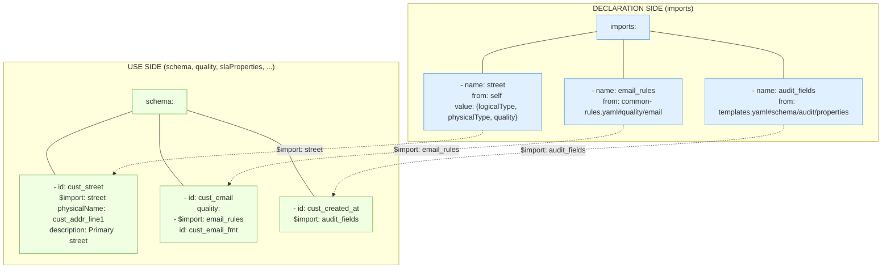

# RFC-0032: Imports — Reusing Definitions Across Contracts

Champion: Diego Carvallo

Authors: Diego Carvallo, Patrick Beitsma, Martin Meermeyer, Jean-Georges Perrin, 

[Slack](https://data-mesh-learning.slack.com/archives/C0AMMR2P98S)

[GitHub issue](https://github.com/bitol-io/open-data-contract-standard/issues/188)

## Summary

Define a mechanism for reusing definitions (quality rules, property definitions, SLA configurations, etc.) across data contracts. Two options are presented with fundamentally different philosophies:

- **Option A** — Imports as a relationship type (`type: imports`) within the existing `relationships` block. The contract references external content that must be resolved at processing time. The contract is **not self-contained** until resolution.
- **Option B** — A top-level `imports` block that declares external sources centrally, with content **always materialized inline**. The contract is **always self-contained**. A preprocessor refreshes materialized content from sources on demand, similar to how a C preprocessor expands `#include` directives.

## Motivation

Data contracts often need to reuse common definitions across multiple contracts:
- **Reusable quality rule libraries**: Standard validation rules (email format, phone format, non-negative amounts)
- **Standard property definitions**: Common audit fields (created_at, updated_at, created_by)
- **Shared SLA templates**: Organization-wide SLA configurations
- **Common authoritative definitions**: Centralized business definitions

Without imports, teams must:
- Copy-paste definitions across contracts (violates DRY principle)
- Manually synchronize changes across multiple contracts
- Risk inconsistencies when definitions drift

## Option A — Imports as a Relationship Type

### Prerequisites

This option depends on:
- RFC-0026a (reference-id) — introduces `id` field for stable references
- RFC-0026b (internal-references) — establishes the `relationships` block structure

### Overview

Extends the `relationships` block with an `imports` type for content transclusion. Imported content is referenced but **not materialized** in the contract — it must be resolved at processing time. The contract depends on external sources being accessible.

### Structure

```yaml
relationships:
  - type: imports
    to: <source-reference>           # Always required - points to what to import
    description: <human-readable-text>
    customProperties:
      - property: <name>
        value: <value>
```

**Important:**
- The `from` field is NEVER used with `imports`
- The `to` field points to the source to import FROM (not the target to import TO)
- Imported content is merged as if it were defined locally

### Field definitions

| Field              | Type   | Required   | Description                                                        |
| ------------------ | ------ | ---------- | ------------------------------------------------------------------ |
| `type`             | enum   | Yes        | Must be: `imports`                                                 |
| `to`               | string | Yes        | Source element reference to import from                            |
| `from`             | N/A    | Never used | Not applicable for `imports`                                       |
| `description`      | string | No         | Human-readable explanation of what is being imported               |
| `customProperties` | array  | No         | Additional metadata following standard custom properties structure |

### Validation rules

Implementations SHOULD validate:

1. **Field requirements:**
   - MUST have `to` field
   - Must NOT have `from` field (it's never used for `imports`)

2. **Import validation:**
   - Content referenced in `to` field must exist and be importable
   - Imported content type must be compatible with target location (e.g., quality rule imports into quality section)
   - Circular imports must be detected and prevented

3. **Reference resolution:**
   - External files must be accessible
   - Referenced paths must resolve correctly

### Processing behavior

When a contract is processed/validated:

1. **Resolution**: The `to` reference is resolved to the source definition
2. **Type Checking**: Verify the imported content type is compatible with target location
3. **Merging**: The imported content is merged into the target as if it were defined locally
4. **Circular Detection**: Check for circular import chains and reject if found
5. **Validation**: The merged result is validated according to ODCS schema rules

### Example A-1: Import quality rules via relationships

**common-quality-rules.yaml** (Shared Library):
```yaml
apiVersion: v3.2.0
kind: DataContract
id: common-quality-rules
version: 1.0.0
title: Shared Quality Rules Library

quality:
  - id: email_validation
    name: email_format_check
    metric: pattern
    arguments:
      regex: '^[a-zA-Z0-9._%+-]+@[a-zA-Z0-9.-]+\.[a-zA-Z]{2,}$'
    description: Standard email format validation

  - id: non_negative_amount
    name: amount_non_negative
    metric: invalidValues
    arguments:
      validValues: ['>=0']
    description: Ensures monetary amounts are non-negative
```

**customer-contract.yaml** (Consumer Contract):
```yaml
apiVersion: v3.2.0
kind: DataContract
id: customer-master-data
version: 1.5.0

schema:
  - id: customers
    name: customers
    properties:
      - id: email_field
        name: email
        logicalType: string
        relationships:
          - type: imports
            to: common-quality-rules.yaml#quality.email_validation
            description: Import standard email validation

      - id: account_balance
        name: balance
        logicalType: number
        relationships:
          - type: imports
            to: common-quality-rules.yaml#quality.non_negative_amount
            description: Balance cannot be negative
```

After import processing, the email property is equivalent to:
```yaml
      - id: email_field
        name: email
        logicalType: string
        quality:
          - id: email_validation
            name: email_format_check
            metric: pattern
            arguments:
              regex: '^[a-zA-Z0-9._%+-]+@[a-zA-Z0-9.-]+\.[a-zA-Z]{2,}$'
            description: Standard email format validation
```

### Example A-2: Import audit field properties

```yaml
# templates.yaml (Shared Template Library)
schema:
  - id: audit_fields_template
    name: audit_fields
    properties:
      - id: created_at_field
        name: created_at
        logicalType: timestamp
        required: true
        description: Timestamp when record was created

      - id: updated_at_field
        name: updated_at
        logicalType: timestamp
        required: true
        description: Timestamp when record was last updated
```

```yaml
# orders-contract.yaml (Consumer)
schema:
  - id: orders
    name: orders
    relationships:
      - type: imports
        to: templates.yaml#/schema/audit_fields_template.properties
        description: "Import standard audit fields (created_at, updated_at)"
    properties:
      - id: order_id
        name: order_id
        logicalType: integer
      # Audit fields will be merged here after resolution
```

---

## Option B — Top-Level Imports with Materialized Content

### Prerequisites

No RFC dependencies beyond the ODCS v3.1.0 baseline. This option introduces its own top-level `imports` section and `$import` annotation, independent of the `relationships` mechanism.

### Overview

A new top-level `imports` section declares all external sources centrally. Content is **always materialized inline** alongside a provenance annotation (`$import`). The contract is always self-contained and valid without resolving any external reference.

A **preprocessor** refreshes the materialized content from external sources on demand — analogous to a C preprocessor expanding `#include` directives. Between refreshes, the contract stands alone.

This design is inspired by RFC-0036 (Environment Variables), which uses a top-level `variables` block to declare named references centrally, then uses `${VAR_NAME}` throughout the contract. Option B applies the same pattern: **declare centrally, reference where needed**.

### Contract structure

A contract using Option B has two distinct zones:



**Declaration side** — The `imports` block at the top of the contract. Declares all import sources (external files or `self`), each with a unique `name`. For `from: self` entries, the `value` object carries the canonical reusable definition. This is the **header** — like `#include` and `#define` in C.

**Use side** — The rest of the contract (`schema`, `quality`, `slaProperties`, etc.). Elements carry `$import: <name>` annotations linking them back to their import source. The content is fully materialized — the `$import` is provenance, not a lazy reference. This is the **body** — like the C code that uses the macros.

The preprocessor flows from declaration side to use side: it reads import sources and refreshes materialized content at every `$import` annotation, overwriting only managed fields (those present in the source) and leaving local fields untouched.

### Design principles

1. **Self-contained contracts.** A contract MUST be fully valid and processable without access to any external source. All imported content is materialized inline.
2. **Provenance tracking.** The `$import` annotation records where content originated, enabling traceability and automated refresh.
3. **Centralized declaration.** All external dependencies are declared in one top-level `imports` block — a single inventory of what this contract pulls from.
4. **Preprocessor-driven refresh.** Updating imported content is an explicit action (running the preprocessor), not a runtime resolution step. This is analogous to the C compilation model: `#include` is expanded before compilation, not resolved at runtime.

### The `imports` section

A new optional top-level section `imports` declares named import sources.

| Field         | Type           | Required | Description                                                                          |
| ------------- | -------------- | -------- | ------------------------------------------------------------------------------------ |
| `name`        | string         | Yes      | Unique local name for this import, used in `$import` references                      |
| `from`        | string         | Yes      | Source reference: file path, URL, contract reference with fragment, or `self`         |
| `description` | string         | No       | Human-readable explanation of what is being imported                                 |
| `value`       | object or array | No       | Inline definition object. Required when `from: self`. The canonical reusable content |

When `from` is an external reference (file path or URL), the `value` field is not used — the preprocessor fetches content from the source. When `from: self`, the `value` field carries the reusable definition inline, making the contract fully self-contained without any external dependency.

```yaml
imports:
  # External imports — content fetched from other files
  - name: email_rules
    from: common-quality-rules.yaml#quality/email_validation
    description: Standard email format validation

  - name: phone_rules
    from: common-quality-rules.yaml#quality/phone_us_format
    description: US phone number format validation

  - name: audit_fields
    from: templates.yaml#schema/audit_fields/properties
    description: Standard audit timestamp fields

  # Self import — reusable definition defined inline
  - name: non_negative
    from: self
    description: Non-negative numeric value check
    value:
      quality:
        - metric: invalidValues
          arguments:
            validValues: ['>=0']
```

### The `$import` annotation

Anywhere within the contract, the `$import` field annotates a materialized element with its import source. The `$import` value is the `name` of an entry in the top-level `imports` section.

The `$import` field is a **provenance annotation** — it does not trigger resolution. The content alongside it is the actual, materialized content. The contract is fully valid if `$import` annotations are stripped entirely.

### Preprocessor behavior

The preprocessor is an external tool (not part of the runtime contract processing). Its role:

1. **Refresh**: Read each entry in `imports`, fetch the source content (or the `value` object for `from: self`), and update the materialized content at every location that carries the matching `$import` annotation.
2. **Type Checking**: Verify the imported content type is compatible with its target location.
3. **Circular Detection**: Detect and reject circular import chains.

The preprocessor is invoked explicitly (e.g., as a CLI tool or CI step). It is never invoked implicitly during contract validation or consumption.

**Managed vs local fields.** The preprocessor only overwrites fields that are present in the import source (`value` object or external content). Fields at the use site that are **not** in the import source are left untouched. This allows each use site to carry local overrides that survive preprocessing.

For example, if the import `value` defines `logicalType`, `physicalType`, and `quality`, but does **not** define `description`, `required`, `id`, or `physicalName`, then:
- `logicalType`, `physicalType`, and `quality` are **managed** — the preprocessor refreshes them from the source.
- `description`, `required`, `id`, and `physicalName` are **local** — the preprocessor does not touch them.

This means: **do not include a field in the import `value` if it is expected to vary across use sites.** The `value` is the canonical template; everything outside it is site-specific.

### Validation rules

Implementations SHOULD validate:

1. **Structural rules:**
   - Every `$import` value MUST match a `name` in the `imports` section
   - Each `name` in `imports` MUST be unique
   - Content alongside `$import` MUST be structurally valid for its location (e.g., quality rule in a quality section)

2. **Self-containment:**
   - A contract MUST be valid without resolving any external source
   - Tooling MUST NOT require access to `from` references during normal contract processing

3. **Preprocessor rules:**
   - The preprocessor MUST only overwrite fields present in the import source (`value` or external content)
   - The preprocessor MUST NOT overwrite fields at the use site that are absent from the import source (local overrides survive refresh)
   - The preprocessor MUST preserve the `$import` annotation itself
   - The preprocessor MUST update all locations with a matching `$import` annotation
   - The preprocessor MUST detect circular import chains and reject them

**Example — managed vs local fields during refresh:**

Given this import definition:
```yaml
imports:
  - name: street
    from: self
    value:
      logicalType: string
      physicalType: varchar(255)
      quality:
        - metric: nullValues
          mustBe: 0
```

And this use site before refresh:
```yaml
      - $import: street
        id: cust_street_1
        name: street_line_1
        physicalName: cust_addr_line1
        logicalType: string
        physicalType: varchar(255)
        required: true
        description: Primary street address
        quality:
          - id: cust_street1_not_empty
            metric: nullValues
            mustBe: 0
            description: Street address is required
```

If the import `value` changes (e.g., `physicalType` updated to `varchar(500)` and a new quality rule added):
```yaml
imports:
  - name: street
    from: self
    value:
      logicalType: string
      physicalType: varchar(500)           # changed
      quality:
        - metric: nullValues
          mustBe: 0
        - metric: invalidValues            # added
          arguments:
            maxLength: 500
```

After running the preprocessor, the use site becomes:
```yaml
      - $import: street
        id: cust_street_1                  # local — untouched
        name: street_line_1                # local — untouched
        physicalName: cust_addr_line1      # local — untouched
        logicalType: string                # managed — refreshed (unchanged)
        physicalType: varchar(500)         # managed — UPDATED
        required: true                     # local — untouched
        description: Primary street address  # local — untouched
        quality:                           # managed — REFRESHED
          - id: cust_street1_not_empty     # local — untouched
            metric: nullValues             # managed — refreshed
            mustBe: 0                      # managed — refreshed
            description: Street address is required  # local — untouched
          - metric: invalidValues          # managed — ADDED
            arguments:
              maxLength: 500
```

The preprocessor updated `physicalType` and added the new quality rule, but left `id`, `name`, `physicalName`, `required`, `description`, and the existing quality rule's `id` and `description` untouched.

### Example B-1: Import quality rules with materialized content

**common-quality-rules.yaml** (Shared Library — same as Option A):
```yaml
apiVersion: v3.2.0
kind: DataContract
id: common-quality-rules
version: 1.0.0
title: Shared Quality Rules Library

quality:
  - id: email_validation
    name: email_format_check
    metric: pattern
    arguments:
      regex: '^[a-zA-Z0-9._%+-]+@[a-zA-Z0-9.-]+\.[a-zA-Z]{2,}$'
    description: Standard email format validation

  - id: non_negative_amount
    name: amount_non_negative
    metric: invalidValues
    arguments:
      validValues: ['>=0']
    description: Ensures monetary amounts are non-negative
```

**customer-contract.yaml** (Consumer Contract):
```yaml
apiVersion: v3.2.0
kind: DataContract
id: customer-master-data
version: 1.5.0

imports:
  - name: email_rules
    from: common-quality-rules.yaml#quality/email_validation
    description: Standard email format validation
  - name: amount_rules
    from: common-quality-rules.yaml#quality/non_negative_amount
    description: Non-negative amount validation

schema:
  - id: customers
    name: customers
    properties:
      - id: email_field
        name: email
        logicalType: string
        quality:
          - $import: email_rules
            id: email_validation
            name: email_format_check
            metric: pattern
            arguments:
              regex: '^[a-zA-Z0-9._%+-]+@[a-zA-Z0-9.-]+\.[a-zA-Z]{2,}$'
            description: Standard email format validation

      - id: account_balance
        name: balance
        logicalType: number
        quality:
          - $import: amount_rules
            id: non_negative_amount
            name: amount_non_negative
            metric: invalidValues
            arguments:
              validValues: ['>=0']
            description: Ensures monetary amounts are non-negative
```

The contract is fully self-contained. The `$import` annotations are provenance markers. Tooling can validate this contract without ever accessing `common-quality-rules.yaml`.

When the shared library updates its email regex, running the preprocessor refreshes the materialized content in place.

### Example B-2: Import audit field properties

```yaml
apiVersion: v3.2.0
kind: DataContract
id: order-management
version: 2.0.0

imports:
  - name: audit_fields
    from: templates.yaml#schema/audit_fields/properties
    description: Standard audit timestamp fields

schema:
  - id: orders
    name: orders
    properties:
      - id: order_id
        name: order_id
        logicalType: integer

      - $import: audit_fields
        id: created_at_field
        name: created_at
        logicalType: timestamp
        required: true
        description: Timestamp when record was created

      - $import: audit_fields
        id: updated_at_field
        name: updated_at
        logicalType: timestamp
        required: true
        description: Timestamp when record was last updated
```

Each property carries its own `$import` annotation. The preprocessor refreshes all properties tagged with `audit_fields` when the source template changes.

### Example B-3: Mixed imports and local definitions

```yaml
apiVersion: v3.2.0
kind: DataContract
id: crm-contacts
version: 1.0.0

imports:
  - name: email_rules
    from: common-quality-rules.yaml#quality/email_validation
    description: Standard email format validation
  - name: status_values
    from: business-glossary.yaml#schema/customer_concept/properties/customer_status/quality/valid_statuses
    description: Business-defined valid status values

schema:
  - id: contacts
    name: contacts
    properties:
      - id: contact_email
        name: email
        logicalType: string
        quality:
          # Imported rule — provenance tracked
          - $import: email_rules
            id: email_validation
            name: email_format_check
            metric: pattern
            arguments:
              regex: '^[a-zA-Z0-9._%+-]+@[a-zA-Z0-9.-]+\.[a-zA-Z]{2,}$'
            description: Standard email format validation
          # Local rule — no $import, not managed externally
          - id: email_not_null
            metric: nullValues
            mustBe: 0
            description: Email is required for all contacts

      - id: contact_status
        name: status
        logicalType: string
        quality:
          - $import: status_values
            id: valid_statuses
            metric: enumValues
            arguments:
              validValues: ['ACTIVE', 'INACTIVE', 'SUSPENDED', 'CLOSED']
```

Imported and local quality rules coexist naturally. The `$import` annotation distinguishes managed (externally sourced) from local definitions.

### Example B-4: Import SLA properties

```yaml
apiVersion: v3.2.0
kind: DataContract
id: payment-transactions
version: 3.0.0

imports:
  - name: standard_freshness_sla
    from: sla-templates.yaml#slaProperties/data_freshness
    description: Organization-wide data freshness SLA

slaProperties:
  - $import: standard_freshness_sla
    id: data_freshness
    property: freshness
    value: 24
    unit: h
    description: Data must be refreshed within 24 hours

  # Local SLA — not imported
  - id: payment_accuracy
    property: dataQuality
    value: 99.99
    unit: percent
    description: Payment amounts must pass all validation rules
```

The `imports` mechanism works across any section of the contract — quality, slaProperties, properties, or any other array-based section.

### Example B-5: Self-contained address fields reused across multiple tables

This example demonstrates defining reusable address fields — each with its own import entry, quality rules, and physical type — directly within the contract using `from: self`. The same fields are referenced in both `customers` and `suppliers` tables with variations at each use site (different `id`, `physicalName`, and in some cases additional fields like `street_line_2` reusing the `street` definition).

No external file is needed. The contract is entirely self-contained.

```yaml
apiVersion: v3.2.0
kind: DataContract
id: procurement-system
version: 2.0.0
title: Procurement System Contract

imports:
  # Note: value objects contain ONLY managed fields.
  # Fields like description, id, physicalName are local to each use site
  # and are NOT overwritten when the preprocessor refreshes.
  # required is managed for fields that are always required (city, state,
  # postal, country) but omitted from street — which varies per use site.

  - name: street
    from: self
    description: Street address line
    value:
      logicalType: string
      physicalType: varchar(255)
      quality:
        - metric: nullValues
          mustBe: 0

  - name: city
    from: self
    description: City name
    value:
      logicalType: string
      physicalType: varchar(100)
      required: true
      quality:
        - metric: nullValues
          mustBe: 0

  - name: state_province
    from: self
    description: State or province code
    value:
      logicalType: string
      physicalType: varchar(10)
      required: true
      quality:
        - metric: nullValues
          mustBe: 0
        - metric: invalidValues
          arguments:
            maxLength: 10

  - name: postal_code
    from: self
    description: Postal or ZIP code
    value:
      logicalType: string
      physicalType: varchar(20)
      required: true
      quality:
        - metric: nullValues
          mustBe: 0
        - metric: pattern
          arguments:
            regex: '^\d{5}(-\d{4})?$|^[A-Z]\d[A-Z]\s?\d[A-Z]\d$'

  - name: country_code
    from: self
    description: ISO 3166-1 alpha-2 country code
    value:
      logicalType: string
      physicalType: char(2)
      required: true
      quality:
        - metric: nullValues
          mustBe: 0
        - metric: pattern
          arguments:
            regex: '^[A-Z]{2}$'

schema:
  - id: customers_tbl
    name: customers
    logicalType: object
    description: Customer master data
    properties:
      - id: cust_id
        name: id
        logicalType: integer
        physicalType: bigint
        description: Primary key

      - id: cust_name
        name: name
        logicalType: string
        physicalType: varchar(200)

      # --- Address fields from self-imported definitions ---

      - $import: street
        id: cust_street_1
        name: street_line_1
        physicalName: cust_addr_line1
        logicalType: string
        physicalType: varchar(255)
        required: true
        description: Primary street address
        quality:
          - id: cust_street1_not_empty
            metric: nullValues
            mustBe: 0
            description: Street address is required

      # Same street import, used for line 2 — overrides required to false
      - $import: street
        id: cust_street_2
        name: street_line_2
        physicalName: cust_addr_line2
        logicalType: string
        physicalType: varchar(255)
        required: false
        description: Secondary address line (apt, suite, etc.)

      - $import: city
        id: cust_city
        name: city
        physicalName: cust_city
        logicalType: string
        physicalType: varchar(100)
        required: true
        description: City name
        quality:
          - id: cust_city_not_empty
            metric: nullValues
            mustBe: 0
            description: City is required

      - $import: state_province
        id: cust_state
        name: state_province
        physicalName: cust_state
        logicalType: string
        physicalType: varchar(10)
        required: true
        description: State or province code
        quality:
          - id: cust_state_not_empty
            metric: nullValues
            mustBe: 0
            description: State/province is required
          - id: cust_state_length
            metric: invalidValues
            arguments:
              maxLength: 10
            description: State/province code must be 10 characters or fewer

      - $import: postal_code
        id: cust_postal
        name: postal_code
        physicalName: cust_zip
        logicalType: string
        physicalType: varchar(20)
        required: true
        description: Postal or ZIP code
        quality:
          - id: cust_postal_not_empty
            metric: nullValues
            mustBe: 0
            description: Postal code is required
          - id: cust_postal_format
            metric: pattern
            arguments:
              regex: '^\d{5}(-\d{4})?$|^[A-Z]\d[A-Z]\s?\d[A-Z]\d$'
            description: Must be valid US ZIP or Canadian postal code format

      - $import: country_code
        id: cust_country
        name: country_code
        physicalName: cust_country_cd
        logicalType: string
        physicalType: char(2)
        required: true
        description: ISO 3166-1 alpha-2 country code
        quality:
          - id: cust_country_not_empty
            metric: nullValues
            mustBe: 0
            description: Country code is required
          - id: cust_country_format
            metric: pattern
            arguments:
              regex: '^[A-Z]{2}$'
            description: Must be a 2-letter uppercase ISO country code

  - id: suppliers_tbl
    name: suppliers
    logicalType: object
    description: Supplier directory
    properties:
      - id: supplier_id
        name: id
        logicalType: integer
        physicalType: bigint
        description: Primary key

      - id: supplier_name
        name: company_name
        logicalType: string
        physicalType: varchar(300)

      # --- Same imports, different ids and physical names ---

      - $import: street
        id: supplier_street_1
        name: street_line_1
        physicalName: sup_addr_line1
        logicalType: string
        physicalType: varchar(255)
        required: true
        description: Primary street address
        quality:
          - id: supplier_street1_not_empty
            metric: nullValues
            mustBe: 0
            description: Street address is required

      - $import: street
        id: supplier_street_2
        name: street_line_2
        physicalName: sup_addr_line2
        logicalType: string
        physicalType: varchar(255)
        required: false
        description: Secondary address line (apt, suite, etc.)

      - $import: city
        id: supplier_city
        name: city
        physicalName: sup_city
        logicalType: string
        physicalType: varchar(100)
        required: true
        description: City name
        quality:
          - id: supplier_city_not_empty
            metric: nullValues
            mustBe: 0
            description: City is required

      - $import: state_province
        id: supplier_state
        name: state_province
        physicalName: sup_state
        logicalType: string
        physicalType: varchar(10)
        required: true
        description: State or province code
        quality:
          - id: supplier_state_not_empty
            metric: nullValues
            mustBe: 0
            description: State/province is required
          - id: supplier_state_length
            metric: invalidValues
            arguments:
              maxLength: 10
            description: State/province code must be 10 characters or fewer

      - $import: postal_code
        id: supplier_postal
        name: postal_code
        physicalName: sup_zip
        logicalType: string
        physicalType: varchar(20)
        required: true
        description: Postal or ZIP code
        quality:
          - id: supplier_postal_not_empty
            metric: nullValues
            mustBe: 0
            description: Postal code is required
          - id: supplier_postal_format
            metric: pattern
            arguments:
              regex: '^\d{5}(-\d{4})?$|^[A-Z]\d[A-Z]\s?\d[A-Z]\d$'
            description: Must be valid US ZIP or Canadian postal code format

      - $import: country_code
        id: supplier_country
        name: country_code
        physicalName: sup_country_cd
        logicalType: string
        physicalType: char(2)
        required: true
        description: ISO 3166-1 alpha-2 country code
        quality:
          - id: supplier_country_not_empty
            metric: nullValues
            mustBe: 0
            description: Country code is required
          - id: supplier_country_format
            metric: pattern
            arguments:
              regex: '^[A-Z]{2}$'
            description: Must be a 2-letter uppercase ISO country code
```

Key observations:
- **Each address field is its own import** (`street`, `city`, `state_province`, `postal_code`, `country_code`) — itemized, not a monolithic object. Each can be referenced independently.
- **`from: self`** with a **`value` object** — the canonical definition lives inline. No external file needed.
- **`value` contains only managed fields** — `logicalType`, `physicalType`, and `quality`. Fields like `description`, `required`, `id`, and `physicalName` are absent from `value` because they vary per use site.
- **The preprocessor only overwrites what's in `value`.** When refreshed, `logicalType`, `physicalType`, and `quality` are updated from the import source. Site-specific fields (`description`, `required`, `id`, `physicalName`) are left untouched — they survive preprocessing.
- **One `street` definition, two variations** — `cust_street_1` has `required: true` and `description: Primary street address`, while `cust_street_2` reuses the same `$import: street` but with `required: false` and `description: Secondary address line`. Both get the same `logicalType`, `physicalType`, and `quality` from the import.
- **`physicalName` varies per table** — `cust_addr_line1` vs `sup_addr_line1`. The import provides the type and quality rules; the physical mapping is specific to each table.

### Example B-6: Importing from a non-DataContract definition store

Import sources do not have to be data contracts. Organizations can maintain shared definition files with a different `kind` — a centralized library of reusable structures, quality rules, and templates that any contract can import from.

This example uses the companion file [`0032-shared-definitions.yaml`](0032-shared-definitions.yaml), which has `kind: DefinitionStore` — not `kind: DataContract`. It contains reusable address structures with quality rules and common quality rules (email validation, phone format, amount checks).

**0032-shared-definitions.yaml** (excerpt — see full file alongside this RFC):
```yaml
apiVersion: v3.2.0
kind: DefinitionStore
id: acme-shared-definitions
version: 1.0.0
title: ACME Corp Shared Definitions

address:
  - id: street_line_1
    name: street_line_1
    logicalType: string
    required: true
    quality:
      - id: street_not_empty
        metric: nullValues
        mustBe: 0
  - id: city
    name: city
    logicalType: string
    required: true
    quality:
      - id: city_not_empty
        metric: nullValues
        mustBe: 0
  # ... postal_code, country_code, etc.

quality:
  - id: email_validation
    metric: pattern
    arguments:
      regex: '^[a-zA-Z0-9._%+-]+@[a-zA-Z0-9.-]+\.[a-zA-Z]{2,}$'
  - id: non_negative_amount
    metric: invalidValues
    arguments:
      validValues: ['>=0']
```

**retail-contract.yaml** (Consumer — imports from the DefinitionStore):
```yaml
apiVersion: v3.2.0
kind: DataContract
id: retail-orders
version: 1.0.0
title: Retail Orders Contract

imports:
  # Address fields from the shared definition store
  - name: address_street_1
    from: 0032-shared-definitions.yaml#address/street_line_1
    description: Street address with not-null quality rule
  - name: address_city
    from: 0032-shared-definitions.yaml#address/city
    description: City with not-null quality rule
  - name: address_postal
    from: 0032-shared-definitions.yaml#address/postal_code
    description: Postal code with format validation
  - name: address_country
    from: 0032-shared-definitions.yaml#address/country_code
    description: ISO country code with format validation
  # Quality rules from the shared definition store
  - name: email_rules
    from: 0032-shared-definitions.yaml#quality/email_validation
    description: Standard email format validation
  - name: amount_rules
    from: 0032-shared-definitions.yaml#quality/non_negative_amount
    description: Non-negative amount validation

schema:
  - id: customers_tbl
    name: customers
    logicalType: object
    description: Customer master data
    properties:
      - id: cust_id
        name: id
        logicalType: integer

      - id: cust_email
        name: email
        logicalType: string
        quality:
          - $import: email_rules
            id: cust_email_format
            metric: pattern
            arguments:
              regex: '^[a-zA-Z0-9._%+-]+@[a-zA-Z0-9.-]+\.[a-zA-Z]{2,}$'
            description: Standard email format validation

      # Address fields — imported from DefinitionStore
      - $import: address_street_1
        id: cust_street
        name: street_line_1
        logicalType: string
        required: true
        description: Primary street address
        quality:
          - id: cust_street_not_empty
            metric: nullValues
            mustBe: 0
            description: Street address is required

      - $import: address_city
        id: cust_city
        name: city
        logicalType: string
        required: true
        description: City name
        quality:
          - id: cust_city_not_empty
            metric: nullValues
            mustBe: 0
            description: City is required

      - $import: address_postal
        id: cust_postal
        name: postal_code
        logicalType: string
        required: true
        description: Postal or ZIP code
        quality:
          - id: cust_postal_not_empty
            metric: nullValues
            mustBe: 0
            description: Postal code is required
          - id: cust_postal_format
            metric: pattern
            arguments:
              regex: '^\d{5}(-\d{4})?$|^[A-Z]\d[A-Z]\s?\d[A-Z]\d$'
            description: Must be valid US ZIP or Canadian postal code format

      - $import: address_country
        id: cust_country
        name: country_code
        logicalType: string
        required: true
        description: ISO 3166-1 alpha-2 country code
        quality:
          - id: cust_country_not_empty
            metric: nullValues
            mustBe: 0
            description: Country code is required
          - id: cust_country_format
            metric: pattern
            arguments:
              regex: '^[A-Z]{2}$'
            description: Must be a 2-letter uppercase ISO country code

  - id: suppliers_tbl
    name: suppliers
    logicalType: object
    description: Supplier directory
    properties:
      - id: supplier_id
        name: id
        logicalType: integer

      - id: supplier_name
        name: company_name
        logicalType: string

      # Same address fields — same imports, different ids
      - $import: address_street_1
        id: supplier_street
        name: street_line_1
        logicalType: string
        required: true
        description: Primary street address
        quality:
          - id: supplier_street_not_empty
            metric: nullValues
            mustBe: 0
            description: Street address is required

      - $import: address_city
        id: supplier_city
        name: city
        logicalType: string
        required: true
        description: City name
        quality:
          - id: supplier_city_not_empty
            metric: nullValues
            mustBe: 0
            description: City is required

      - $import: address_postal
        id: supplier_postal
        name: postal_code
        logicalType: string
        required: true
        description: Postal or ZIP code
        quality:
          - id: supplier_postal_not_empty
            metric: nullValues
            mustBe: 0
            description: Postal code is required
          - id: supplier_postal_format
            metric: pattern
            arguments:
              regex: '^\d{5}(-\d{4})?$|^[A-Z]\d[A-Z]\s?\d[A-Z]\d$'
            description: Must be valid US ZIP or Canadian postal code format

      - $import: address_country
        id: supplier_country
        name: country_code
        logicalType: string
        required: true
        description: ISO 3166-1 alpha-2 country code
        quality:
          - id: supplier_country_not_empty
            metric: nullValues
            mustBe: 0
            description: Country code is required
          - id: supplier_country_format
            metric: pattern
            arguments:
              regex: '^[A-Z]{2}$'
            description: Must be a 2-letter uppercase ISO country code

  - id: orders_tbl
    name: orders
    logicalType: object
    description: Order transactions
    properties:
      - id: order_id
        name: id
        logicalType: integer

      - id: order_total
        name: total_amount
        logicalType: number
        quality:
          - $import: amount_rules
            id: order_total_non_negative
            metric: invalidValues
            arguments:
              validValues: ['>=0']
            description: Ensures monetary amounts are non-negative
```

Key observations:
- The import source is `kind: DefinitionStore`, **not** `kind: DataContract`. Import sources can be any YAML file with a resolvable structure — they are not limited to data contracts.
- The `DefinitionStore` organizes definitions by purpose (`address`, `quality`) rather than by the data contract schema structure. This makes it a natural fit for organization-wide libraries.
- Both **structural imports** (address fields with their quality rules) and **quality-only imports** (email validation, amount checks) come from the same source file.
- The contract mixes imports from different sections of the same source: `#address/street_line_1` for properties, `#quality/email_validation` for quality rules.
- The companion file [`0032-shared-definitions.yaml`](0032-shared-definitions.yaml) is provided alongside this RFC as a concrete reference.

---

## Option A vs Option B

| Concern                              | Option A (Relationship Type)                                   | Option B (Top-Level Imports)                                                     |
| ------------------------------------ | -------------------------------------------------------------- | -------------------------------------------------------------------------------- |
| **Self-contained contract**          | No — requires resolution at processing time                    | Yes — content always materialized inline                                         |
| **Standard surface area**            | Smaller — reuses existing `relationships` block                | Larger — new `imports` section + `$import` annotation                            |
| **Import declaration**               | Scattered across `relationships` blocks on individual elements | Centralized in one top-level `imports` section                                   |
| **Provenance**                       | Implicit — the `type: imports` relationship is the only trace  | Explicit — `$import` annotation on every materialized element                    |
| **External dependencies at runtime** | Required — tooling must access source files                    | Not required — contract stands alone                                             |
| **Updating from source**             | Automatic at processing time                                   | Explicit — run preprocessor to refresh                                           |
| **Alignment with guiding values**    | Favors a small standard (reuses `relationships`)               | Favors interoperability (self-contained, tool-independent)                       |
| **Precedent in ODCS**                | Consistent with RFC-0026b relationship patterns                | Consistent with RFC-0036 variable declaration pattern                            |
| **Programming analogy**              | Dynamic linking — resolved at load time                        | Static linking with source annotation — expanded at build time, traced to origin |

---

## Use Cases

Key scenarios enabled by both options:

1. **Centralized Quality Rule Management**: Maintain validation rules in one place, import everywhere
2. **Standard Field Templates**: Define common fields (audit timestamps, metadata) once, reuse across contracts
3. **Business Rule Consistency**: Import business-defined validation rules into technical contracts
4. **Compliance Templates**: Share regulatory compliance rules across organization
5. **Multi-System Consistency**: Ensure same validation rules apply across CRM, DWH, and BI systems
6. **Version Control**: Update shared library once, all consumers get updated rules
7. **DRY Principle**: Eliminate copy-paste duplication of common definitions

---

## Alternatives Considered

1. **Copy-paste approach**: Simple but violates DRY, creates maintenance burden
2. **JSON Schema $ref**: Too low-level, doesn't fit ODCS semantic model
3. **Template inheritance**: More complex, less explicit than targeted imports
4. **YAML anchors and aliases**: Only works within a single file, not across contracts

## Decision

> The decision made by the TSC.

## Consequences

### Positive (both options)
- Enables DRY patterns for data contracts
- Centralized management of common definitions
- Consistent validation rules across contracts
- Easier maintenance and updates
- Clear dependency tracking

### Positive (Option A only)
- No new top-level concepts — reuses the established `relationships` pattern
- Lighter specification change

### Positive (Option B only)
- Contracts are always self-contained and valid without external access
- Single inventory of all external dependencies in `imports` block
- Explicit provenance on every imported element
- No runtime resolution required — simpler tooling for consumers
- Updating from source is an explicit, auditable action

### Negative (Option A)
- Contracts are not self-contained — tooling must resolve external references
- Import declarations scattered across individual elements
- Circular import detection required at runtime

### Negative (Option B)
- Larger specification surface area (new `imports` section + `$import` annotation)
- Content duplication between source and consumer contracts (by design — the cost of self-containment)
- Requires a preprocessor tool to refresh content from sources

### Neutral
- Documentation must explain import behavior clearly
- Both options require tooling support, though at different stages (runtime vs build time)

## References

- RFC-0026a (reference-id) — stable references using `id` fields
- RFC-0026b (internal-references) — `relationships` block structure
- RFC-0036 (environment variables) — top-level `variables` declaration pattern (inspiration for Option B)
- OpenAPI `$ref` mechanism
- JSON Schema `$ref`
- C/C++ preprocessor `#include` and `#define` model (inspiration for Option B)
- Terraform modules
- DRY principle (Don't Repeat Yourself)

Formerly part of RFC 0026.
