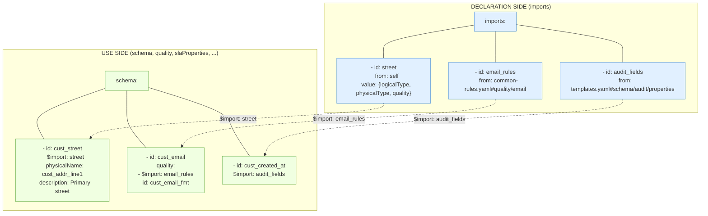

# RFC-0032: Imports — Reusing Definitions Across Contracts

Champion: Diego Carvallo

Authors: Diego Carvallo, Patrick Beitsma, Martin Meermeyer, Jean-Georges Perrin, 

[Slack](https://data-mesh-learning.slack.com/archives/C0AMMR2P98S)

[GitHub issue](https://github.com/bitol-io/open-data-contract-standard/issues/188)

Applies to:
* [X] ODCS - Open Data Contract Standard
* [X] ODPS - Open Data Product Standard
* [ ] OORS - Open Observability Results Standard
* [ ] OOCS - Open Orchestration and Control Standard
* [ ] OMMS - Open Maturity Model Standard
* [ ] OMDS - Open Metadata Difference Standard
* [X] OSDS - Open Semantic Definition Standard *(Option C only — as an import source, and as the standard Option C places requirements on)*

## Summary

Define a mechanism for reusing definitions (quality rules, property definitions, SLA configurations, etc.) across data contracts. Three options are presented with fundamentally different philosophies:

- **Option A** — Imports as a relationship type (`type: imports`) within the existing `relationships` block. The contract references external content that must be resolved at processing time. The contract is **not self-contained** until resolution.
- **Option B** — A top-level `imports` block that declares external sources centrally, with content **always materialized inline**. The contract is **always self-contained**. A preprocessor refreshes materialized content from sources on demand, similar to how a C preprocessor expands `#include` directives.
- **Option C** — No new block at all. An element binds to a definition through the already-shared Authoritative Definitions block, using one new recommended `type` value, and **inherits** the attributes it does not state itself. The source is an OSDS semantic definition, or another document of the element's own standard — an ODCS contract for ODCS, an ODPS product for ODPS. Inline values always win, and an unresolved reference costs inherited attributes rather than breaking the document.

## Motivation

Data contracts often need to reuse common definitions across multiple contracts:
- **Reusable quality rule libraries**: Standard validation rules (email format, phone format, non-negative amounts)
- **Standard property definitions**: Common audit fields (created_at, updated_at, created_by)
- **Shared SLA templates**: Organization-wide SLA configurations
- **Common authoritative definitions**: Centralized business definitions

Without imports, teams must:
- Copy-paste definitions across contracts (violates DRY principle)
- Manually synchronize changes across multiple contracts
- Risk inconsistencies when definitions drift

## Option A — Imports as a Relationship Type

### Prerequisites

This option depends on:
- RFC-0026a (reference-id) — introduces `id` field for stable references
- RFC-0026b (internal-references) — establishes the `relationships` block structure

### Overview

Extends the `relationships` block with an `imports` type for content transclusion. Imported content is referenced but **not materialized** in the contract — it must be resolved at processing time. The contract depends on external sources being accessible.

### Structure

```yaml
relationships:
  - type: imports
    to: <source-reference>           # Always required - points to what to import
    description: <human-readable-text>
    customProperties:
      - property: <name>
        value: <value>
```

**Important:**
- The `from` field is NEVER used with `imports`
- The `to` field points to the source to import FROM (not the target to import TO)
- Imported content is merged as if it were defined locally

### Field definitions

| Field              | Type   | Required   | Description                                                        |
| ------------------ | ------ | ---------- | ------------------------------------------------------------------ |
| `type`             | enum   | Yes        | Must be: `imports`                                                 |
| `to`               | string | Yes        | Source element reference to import from                            |
| `from`             | N/A    | Never used | Not applicable for `imports`                                       |
| `description`      | string | No         | Human-readable explanation of what is being imported               |
| `customProperties` | array  | No         | Additional metadata following standard custom properties structure |

### Validation rules

Implementations SHOULD validate:

1. **Field requirements:**
   - MUST have `to` field
   - Must NOT have `from` field (it's never used for `imports`)

2. **Import validation:**
   - Content referenced in `to` field must exist and be importable
   - Imported content type must be compatible with target location (e.g., quality rule imports into quality section)
   - Circular imports must be detected and prevented

3. **Reference resolution:**
   - External files must be accessible
   - Referenced paths must resolve correctly

### Processing behavior

When a contract is processed/validated:

1. **Resolution**: The `to` reference is resolved to the source definition
2. **Type Checking**: Verify the imported content type is compatible with target location
3. **Merging**: The imported content is merged into the target as if it were defined locally
4. **Circular Detection**: Check for circular import chains and reject if found
5. **Validation**: The merged result is validated according to ODCS schema rules

### Example A-1: Import quality rules via relationships

**common-quality-rules.yaml** (Shared Library):
```yaml
apiVersion: v3.2.0
kind: DataContract
id: common-quality-rules
version: 1.0.0
title: Shared Quality Rules Library

quality:
  - id: email_validation
    name: email_format_check
    metric: pattern
    arguments:
      regex: '^[a-zA-Z0-9._%+-]+@[a-zA-Z0-9.-]+\.[a-zA-Z]{2,}$'
    description: Standard email format validation

  - id: non_negative_amount
    name: amount_non_negative
    metric: invalidValues
    arguments:
      validValues: ['>=0']
    description: Ensures monetary amounts are non-negative
```

**customer-contract.yaml** (Consumer Contract):
```yaml
apiVersion: v3.2.0
kind: DataContract
id: customer-master-data
version: 1.5.0

schema:
  - id: customers
    name: customers
    properties:
      - id: email_field
        name: email
        logicalType: string
        relationships:
          - type: imports
            to: common-quality-rules.yaml#quality/email_validation
            description: Import standard email validation

      - id: account_balance
        name: balance
        logicalType: number
        relationships:
          - type: imports
            to: common-quality-rules.yaml#quality/non_negative_amount
            description: Balance cannot be negative
```

After import processing, the email property is equivalent to:
```yaml
      - id: email_field
        name: email
        logicalType: string
        quality:
          - id: email_validation
            name: email_format_check
            metric: pattern
            arguments:
              regex: '^[a-zA-Z0-9._%+-]+@[a-zA-Z0-9.-]+\.[a-zA-Z]{2,}$'
            description: Standard email format validation
```

### Example A-2: Import audit field properties

```yaml
# templates.yaml (Shared Template Library)
schema:
  - id: audit_fields_template
    name: audit_fields
    properties:
      - id: created_at_field
        name: created_at
        logicalType: timestamp
        required: true
        description: Timestamp when record was created

      - id: updated_at_field
        name: updated_at
        logicalType: timestamp
        required: true
        description: Timestamp when record was last updated
```

```yaml
# orders-contract.yaml (Consumer)
schema:
  - id: orders
    name: orders
    relationships:
      - type: imports
        to: templates.yaml#schema/audit_fields_template/properties
        description: "Import standard audit fields (created_at, updated_at)"
    properties:
      - id: order_id
        name: order_id
        logicalType: integer
      # Audit fields will be merged here after resolution
```

### Applicability to ODPS

To extend Option A to ODPS (Open Data Product Standard), the following would be required:

1. **Add `relationships` to ODPS.** ODPS v1.0.0 does not have a `relationships` block. RFC-0026b's relationship structure would need to be adopted into ODPS first — a significant prerequisite.
2. **Extend the `type: imports` enum.** The `imports` relationship type would need to be added to the ODPS JSON schema.
3. **Define valid import targets.** ODPS has different sections than ODCS (e.g., `inputPorts`, `outputPorts`, `managementPorts`). Import resolution rules would need to map content types to valid ODPS locations.

**Effort:** High — requires adopting the `relationships` mechanism into ODPS first.

---

## Option B — Top-Level Imports with Materialized Content

### Prerequisites

No RFC dependencies beyond the ODCS v3.1.0 baseline. This option introduces its own top-level `imports` section and `$import` annotation, independent of the `relationships` mechanism.

### Overview

A new top-level `imports` section declares all external sources centrally. Content is **always materialized inline** alongside a provenance annotation (`$import`). The contract is always self-contained and valid without resolving any external reference.

A **preprocessor** refreshes the materialized content from external sources on demand — analogous to a C preprocessor expanding `#include` directives. Between refreshes, the contract stands alone.

This design is inspired by RFC-0036 (Environment Variables), which uses a top-level `variables` block to declare named references centrally, then uses `${VAR_NAME}` throughout the contract. Option B applies the same pattern: **declare centrally, reference where needed**.

### Contract structure

A contract using Option B has two distinct zones:


```mermaid
graph TB
    subgraph "DECLARATION SIDE (imports)"
        direction TB
        I1["imports:"]
        I2["  - id: street<br/>    from: self<br/>    value: {logicalType, physicalType, quality}"]
        I3["  - id: email_rules<br/>    from: common-rules.yaml#quality/email<br/>"]
        I4["  - id: audit_fields<br/>    from: templates.yaml#schema/audit/properties"]
        I1 --- I2
        I1 --- I3
        I1 --- I4
    end

    subgraph "USE SIDE (schema, quality, slaProperties, ...)"
        direction TB
        S1["schema:"]
        S2["  - id: cust_street<br/>    $import: street<br/>    physicalName: cust_addr_line1<br/>    description: Primary street"]
        S3["  - id: cust_email<br/>    quality:<br/>      - $import: email_rules<br/>        id: cust_email_fmt"]
        S4["  - id: cust_created_at<br/>    $import: audit_fields"]
        S1 --- S2
        S1 --- S3
        S1 --- S4
    end

    I2 -. "$import: street" .-> S2
    I3 -. "$import: email_rules" .-> S3
    I4 -. "$import: audit_fields" .-> S4

    style I1 fill:#e1f0ff,stroke:#4a90d9
    style I2 fill:#e1f0ff,stroke:#4a90d9
    style I3 fill:#e1f0ff,stroke:#4a90d9
    style I4 fill:#e1f0ff,stroke:#4a90d9
    style S1 fill:#f0ffe1,stroke:#6ab04c
    style S2 fill:#f0ffe1,stroke:#6ab04c
    style S3 fill:#f0ffe1,stroke:#6ab04c
    style S4 fill:#f0ffe1,stroke:#6ab04c
```

**Declaration side** — The `imports` block at the top of the contract. Declares all import sources (external files or `self`), each with a unique `id`. For `from: self` entries, the `value` object carries the canonical reusable definition. This is the **header** — like `#include` and `#define` in C.

**Use side** — The rest of the contract (`schema`, `quality`, `slaProperties`, etc.). Elements carry `$import: <id>` annotations linking them back to their import source. The content is fully materialized — the `$import` is provenance, not a lazy reference. This is the **body** — like the C code that uses the macros.

The preprocessor flows from declaration side to use side: it reads import sources and refreshes materialized content at every `$import` annotation, overwriting only managed fields (those present in the source) and leaving local fields untouched.

### Design principles

1. **Self-contained contracts.** A contract MUST be fully valid and processable without access to any external source. All imported content is materialized inline.
2. **Provenance tracking.** The `$import` annotation records where content originated, enabling traceability and automated refresh.
3. **Centralized declaration.** All external dependencies are declared in one top-level `imports` block — a single inventory of what this contract pulls from.
4. **Preprocessor-driven refresh.** Updating imported content is an explicit action (running the preprocessor), not a runtime resolution step. This is analogous to the C compilation model: `#include` is expanded before compilation, not resolved at runtime.

### The `imports` section (declaration side)

The **declaration side** of the contract. A new optional top-level section `imports` declares named import sources.

| Field         | UX label    | Type            | Required | Description                                                                           |
| ------------- | ----------- | --------------- | -------- | ------------------------------------------------------------------------------------- |
| `id`          | Id          | string          | Yes      | Unique local identifier for this import, used in `$import` references.                |
| `from`        | From        | string          | Yes      | Source reference: file path, URL, contract reference with fragment, or `self`.        |
| `type`        | Type        | enum            | No       | Schema type of the imported content. Enables validation of `value` and use sites.     |
| `description` | Description | string          | No       | Human-readable explanation of what is being imported.                                 |
| `value`       | Value       | object or array | No       | Inline definition object. Required when `from: self`. The canonical reusable content. |

**The `type` field** declares what kind of ODCS element the import represents, using the names from the `$defs` section of the ODCS JSON schema. This allows tooling to:
- Validate the `value` object on the declaration side against the corresponding `$defs` definition in the JSON schema
- Validate that use sites place the imported content in a compatible location (e.g., a `DataQualityChecks` import must appear inside a `quality:` array, not inside `slaProperties:`)
- As we reuse those elements from the JSON Schema, we may want to rename them in a more meaningful way. Until now, they were hidden internal constructs.

| `type` value                    | JSON schema `$defs`             | Valid use side locations                  |
| ------------------------------- | ------------------------------- | ----------------------------------------- |
| `DataQualityChecks`             | `DataQualityChecks`             | `quality:` arrays on properties or schema |
| `DataQualityLibrary`            | `DataQualityLibrary`            | `quality:` arrays (library-type rules)    |
| `DataQualityCustom`             | `DataQualityCustom`             | `quality:` arrays (custom rules)          |
| `DataQualitySql`                | `DataQualitySql`                | `quality:` arrays (SQL-based rules)       |
| `SchemaProperty`                | `SchemaProperty`                | `properties:` arrays on schema objects    |
| `SchemaObject`                  | `SchemaObject`                  | `schema:` array                           |
| `ServiceLevelAgreementProperty` | `ServiceLevelAgreementProperty` | `slaProperties:` array                    |
| `CustomProperty`                | `CustomProperty`                | `customProperties:` arrays                |
| `AuthoritativeDefinitions`      | `AuthoritativeDefinitions`      | `authoritativeDefinitions:` arrays        |
| `Server`                        | `Server`                        | `servers:` array                          |
| `SupportItem`                   | `SupportItem`                   | `support:` array                          |
| `TeamMember`                    | `TeamMember`                    | `team:` array                             |
| `Role`                          | `Role`                          | `roles:` array                            |

When `type` is omitted, tooling MAY infer the type from the `from` path fragment or from the structure of `value`, but SHOULD warn that explicit typing is recommended.

When `from` is an external reference (file path or URL), the `value` field is not used — the preprocessor fetches content from the source. When `from: self`, the `value` field carries the reusable definition inline, making the contract fully self-contained without any external dependency.

```yaml
imports:
  # DECLARATION SIDE: external imports — content fetched from other files
  - id: email_rules
    from: common-quality-rules.yaml#quality/email_validation # !!!!!!!!!!!!!!!!!!!! VERSION !!!!!!!!!!!!!!!!!!!!!!!
    type: DataQualityChecks
    description: Standard email format validation

  - id: phone_rules
    from: common-quality-rules.yaml#quality/phone_us_format # !!!!!!!!!!!!!!!!!!!! VERSION !!!!!!!!!!!!!!!!!!!!!!!
    type: DataQualityChecks
    description: US phone number format validation

  - id: audit_fields
    from: templates.yaml#schema/audit_fields/properties # !!!!!!!!!!!!!!!!!!!! VERSION !!!!!!!!!!!!!!!!!!!!!!!
    type: SchemaProperty
    description: Standard audit timestamp fields

  # DECLARATION SIDE: self import — reusable definition defined inline
  - id: non_negative
    from: self
    type: DataQualityChecks
    description: Non-negative numeric value check
    value:
      metric: invalidValues
      arguments:
        validValues: ['>=0']
```

### The `$import` annotation (use side)

The **use side** of the contract — everything outside the `imports` block (`schema`, `quality`, `slaProperties`, etc.). At each **use site**, the `$import` field annotates a materialized element with the `id` of its import source from the declaration side.

The `$import` field is a **provenance annotation** — it does not trigger resolution. The content alongside it is the actual, materialized content. The contract is fully valid if `$import` annotations are stripped entirely.

### Preprocessor behavior

The preprocessor is an external tool (not part of the runtime contract processing). Its role:

1. **Refresh**: Read each entry on the declaration side, fetch the source content (or the `value` object for `from: self`), and update the materialized content at every use site on the use side that carries the matching `$import` annotation.
2. **Type Checking**: Verify the imported content type is compatible with its target location.
3. **Circular Detection**: Detect and reject circular import chains.

The preprocessor is invoked explicitly (e.g., as a CLI tool or CI step). It is never invoked implicitly during contract validation or consumption.

**Managed vs local fields.** The preprocessor only overwrites **managed fields** — those present in the declaration side (`value` object or external content). **Local fields** — those at the use site that are **not** in the declaration side — are left untouched. This allows each use site to carry overrides that survive preprocessing.

For example, if the declaration side `value` defines `logicalType`, `physicalType`, and `quality`, but does **not** define `description`, `required`, `id`, or `physicalName`, then:
- `logicalType`, `physicalType`, and `quality` are **managed fields** — the preprocessor refreshes them from the declaration side.
- `description`, `required`, `id`, and `physicalName` are **local fields** — the preprocessor does not touch them.

This means: **do not include a field in the declaration side `value` if it is expected to vary across use sites.** The `value` is the canonical template; everything outside it is site-specific.

### Validation rules

Implementations SHOULD validate:

1. **Structural rules:**
   - Every `$import` value on the use side MUST match an `id` on the declaration side
   - Each `id` on the declaration side MUST be unique
   - Content alongside `$import` on the use side MUST be structurally valid for its location (e.g., quality rule in a quality section)

2. **Self-containment:**
   - A contract MUST be valid without resolving any external source
   - Tooling MUST NOT require access to `from` references during normal contract processing

3. **Preprocessor rules:**
   - The preprocessor MUST only overwrite managed fields (those present on the declaration side)
   - The preprocessor MUST NOT overwrite local fields at the use site (those absent from the declaration side survive refresh)
   - The preprocessor MUST preserve the `$import` annotation itself
   - The preprocessor MUST update all locations with a matching `$import` annotation
   - The preprocessor MUST detect circular import chains and reject them

**Example — managed vs local fields during refresh:**

Given this declaration side entry:
```yaml
imports:
  - id: street
    from: self
    value:
      logicalType: string
      physicalType: varchar(255)
      quality:
        - metric: nullValues
          mustBe: 0
```

And this use site (on the use side) before refresh:
```yaml
      - $import: street
        id: cust_street_1
        name: street_line_1
        physicalName: cust_addr_line1
        logicalType: string
        physicalType: varchar(255)
        required: true
        description: Primary street address
        quality:
          - id: cust_street1_not_empty
            metric: nullValues
            mustBe: 0
            description: Street address is required
```

If the declaration side `value` changes (e.g., `physicalType` updated to `varchar(500)` and a new quality rule added):
```yaml
imports:
  - id: street
    from: self
    value:
      logicalType: string
      physicalType: varchar(500)           # changed
      quality:
        - metric: nullValues
          mustBe: 0
        - metric: invalidValues            # added
          arguments:
            maxLength: 500
```

After running the preprocessor, the use site becomes:
```yaml
      - $import: street
        id: cust_street_1                  # local — untouched
        name: street_line_1                # local — untouched
        physicalName: cust_addr_line1      # local — untouched
        logicalType: string                # managed — refreshed (unchanged)
        physicalType: varchar(500)         # managed — UPDATED
        required: true                     # local — untouched
        description: Primary street address  # local — untouched
        quality:                           # managed — REFRESHED
          - id: cust_street1_not_empty     # local — untouched
            metric: nullValues             # managed — refreshed
            mustBe: 0                      # managed — refreshed
            description: Street address is required  # local — untouched
          - metric: invalidValues          # managed — ADDED
            arguments:
              maxLength: 500
```

The preprocessor updated managed fields (`physicalType`, quality `metric`/`mustBe`/`arguments`) from the declaration side, and added the new quality rule. Local fields (`id`, `name`, `physicalName`, `required`, `description`, and the existing quality rule's local `id` and `description`) were untouched.

### Example B-1: Import quality rules with materialized content

The declaration side references an external quality rules library. The use side materializes the rules inline with `$import` provenance annotations.

**common-quality-rules.yaml** (Shared Library — same as Option A):
```yaml
apiVersion: v3.2.0
kind: DataContract
id: common-quality-rules
version: 1.0.0
title: Shared Quality Rules Library

quality:
  - id: email_validation
    name: email_format_check
    metric: pattern
    arguments:
      regex: '^[a-zA-Z0-9._%+-]+@[a-zA-Z0-9.-]+\.[a-zA-Z]{2,}$'
    description: Standard email format validation

  - id: non_negative_amount
    name: amount_non_negative
    metric: invalidValues
    arguments:
      validValues: ['>=0']
    description: Ensures monetary amounts are non-negative
```

**customer-contract.yaml** (Consumer Contract):
```yaml
apiVersion: v3.2.0
kind: DataContract
id: customer-master-data
version: 1.5.0

imports:
  - id: email_rules
    from: common-quality-rules.yaml#quality/email_validation
    type: DataQualityChecks
    description: Standard email format validation
  - id: amount_rules
    from: common-quality-rules.yaml#quality/non_negative_amount
    type: DataQualityChecks
    description: Non-negative amount validation

schema:
  - id: customers
    name: customers
    properties:
      - id: email_field
        name: email
        logicalType: string
        quality:
          - $import: email_rules
            id: email_validation
            name: email_format_check
            metric: pattern
            arguments:
              regex: '^[a-zA-Z0-9._%+-]+@[a-zA-Z0-9.-]+\.[a-zA-Z]{2,}$'
            description: Standard email format validation

      - id: account_balance
        name: balance
        logicalType: number
        quality:
          - $import: amount_rules
            id: non_negative_amount
            name: amount_non_negative
            metric: invalidValues
            arguments:
              validValues: ['>=0']
            description: Ensures monetary amounts are non-negative
```

The contract is fully self-contained. The `$import` annotations on the use side are provenance markers linking back to the declaration side. Tooling can validate this contract without ever accessing `common-quality-rules.yaml`.

When the shared library updates its email regex, running the preprocessor refreshes managed fields at every use site.

### Example B-2: Import audit field properties

The declaration side references an external template library. Each property on the use side carries `$import` linking it back to the declaration.

```yaml
apiVersion: v3.2.0
kind: DataContract
id: order-management
version: 2.0.0

imports:
  - id: audit_fields
    from: templates.yaml#schema/audit_fields/properties
    type: SchemaProperty
    description: Standard audit timestamp fields

schema:
  - id: orders
    name: orders
    properties:
      - id: order_id
        name: order_id
        logicalType: integer

      - $import: audit_fields
        id: created_at_field
        name: created_at
        logicalType: timestamp
        required: true
        description: Timestamp when record was created

      - $import: audit_fields
        id: updated_at_field
        name: updated_at
        logicalType: timestamp
        required: true
        description: Timestamp when record was last updated
```

Each property carries its own `$import` annotation. The preprocessor refreshes all properties tagged with `audit_fields` when the source template changes.

### Example B-3: Mixed imports and local definitions

Quality rules on the use side can mix imported rules (with `$import` provenance from the declaration side) and local rules (no `$import`, not managed by the preprocessor).

```yaml
apiVersion: v3.2.0
kind: DataContract
id: crm-contacts
version: 1.0.0

imports:
  - id: email_rules
    from: common-quality-rules.yaml#quality/email_validation
    type: DataQualityChecks
    description: Standard email format validation
  - id: status_values
    from: business-glossary.yaml#schema/customer_concept/properties/customer_status/quality/valid_statuses
    type: DataQualityChecks
    description: Business-defined valid status values

schema:
  - id: contacts
    name: contacts
    properties:
      - id: contact_email
        name: email
        logicalType: string
        quality:
          # Managed — from declaration side, refreshed by preprocessor
          - $import: email_rules
            id: email_validation
            name: email_format_check
            metric: pattern
            arguments:
              regex: '^[a-zA-Z0-9._%+-]+@[a-zA-Z0-9.-]+\.[a-zA-Z]{2,}$'
            description: Standard email format validation
          # Local — no $import, not on declaration side, untouched by preprocessor
          - id: email_not_null
            metric: nullValues
            mustBe: 0
            description: Email is required for all contacts

      - id: contact_status
        name: status
        logicalType: string
        quality:
          - $import: status_values
            id: valid_statuses
            metric: enumValues
            arguments:
              validValues: ['ACTIVE', 'INACTIVE', 'SUSPENDED', 'CLOSED']
```

Imported and local quality rules coexist naturally on the use side. The `$import` annotation distinguishes managed fields (sourced from the declaration side) from local fields (defined only at the use site).

### Example B-4: Import SLA properties

The declaration side and use side pattern works across any section — here, `slaProperties` on the use side references an SLA template from the declaration side.

```yaml
apiVersion: v3.2.0
kind: DataContract
id: payment-transactions
version: 3.0.0

imports:
  - id: standard_freshness_sla
    from: sla-templates.yaml#slaProperties/data_freshness
    type: ServiceLevelAgreementProperty
    description: Organization-wide data freshness SLA

slaProperties:
  - $import: standard_freshness_sla
    id: data_freshness
    property: freshness
    value: 24
    unit: h
    description: Data must be refreshed within 24 hours

  # Local — not on declaration side
  - id: payment_accuracy
    property: dataQuality
    value: 99.99
    unit: percent
    description: Payment amounts must pass all validation rules
```

The `imports` mechanism works across any section of the contract — quality, slaProperties, properties, or any other array-based section.

### Example B-5: Self-contained address fields reused across multiple tables

This example demonstrates defining reusable address fields — each with its own import entry, quality rules, and physical type — directly within the contract using `from: self`. The same fields are referenced in both `customers` and `suppliers` tables with variations at each use site (different `id`, `physicalName`, and in some cases additional fields like `street_line_2` reusing the `street` definition).

No external file is needed. The contract is entirely self-contained.

```yaml
apiVersion: v3.2.0
kind: DataContract
id: procurement-system
version: 2.0.0
title: Procurement System Contract

imports:
  # DECLARATION SIDE: value objects contain ONLY managed fields.
  # Fields like description, id, physicalName are local to each use site
  # and are NOT overwritten when the preprocessor refreshes.
  # required is managed for fields that are always required (city, state,
  # postal, country) but omitted from street — which varies per use site.

  - id: street
    from: self
    type: SchemaProperty
    description: Street address line
    value:
      logicalType: string
      physicalType: varchar(255)
      quality:
        - metric: nullValues
          mustBe: 0

  - id: city
    from: self
    type: SchemaProperty
    description: City name
    value:
      logicalType: string
      physicalType: varchar(100)
      required: true
      quality:
        - metric: nullValues
          mustBe: 0

  - id: state_province
    from: self
    type: SchemaProperty
    description: State or province code
    value:
      logicalType: string
      physicalType: varchar(10)
      required: true
      quality:
        - metric: nullValues
          mustBe: 0
        - metric: invalidValues
          arguments:
            maxLength: 10

  - id: postal_code
    from: self
    type: SchemaProperty
    description: Postal or ZIP code
    value:
      logicalType: string
      physicalType: varchar(20)
      required: true
      quality:
        - metric: nullValues
          mustBe: 0
        - metric: pattern
          arguments:
            regex: '^\d{5}(-\d{4})?$|^[A-Z]\d[A-Z]\s?\d[A-Z]\d$'

  - id: country_code
    from: self
    type: SchemaProperty
    description: ISO 3166-1 alpha-2 country code
    value:
      logicalType: string
      physicalType: char(2)
      required: true
      quality:
        - metric: nullValues
          mustBe: 0
        - metric: pattern
          arguments:
            regex: '^[A-Z]{2}$'

schema:
  - id: customers_tbl
    name: customers
    logicalType: object
    description: Customer master data
    properties:
      - id: cust_id
        name: id
        logicalType: integer
        physicalType: bigint
        description: Primary key

      - id: cust_name
        name: name
        logicalType: string
        physicalType: varchar(200)

      # --- USE SIDE: address fields from declaration side ---

      - $import: street
        id: cust_street_1
        name: street_line_1
        physicalName: cust_addr_line1
        logicalType: string
        physicalType: varchar(255)
        required: true
        description: Primary street address
        quality:
          - id: cust_street1_not_empty
            metric: nullValues
            mustBe: 0
            description: Street address is required

      # Same street from declaration side — local field required overridden to false
      - $import: street
        id: cust_street_2
        name: street_line_2
        physicalName: cust_addr_line2
        logicalType: string
        physicalType: varchar(255)
        required: false
        description: Secondary address line (apt, suite, etc.)

      - $import: city
        id: cust_city
        name: city
        physicalName: cust_city
        logicalType: string
        physicalType: varchar(100)
        required: true
        description: City name
        quality:
          - id: cust_city_not_empty
            metric: nullValues
            mustBe: 0
            description: City is required

      - $import: state_province
        id: cust_state
        name: state_province
        physicalName: cust_state
        logicalType: string
        physicalType: varchar(10)
        required: true
        description: State or province code
        quality:
          - id: cust_state_not_empty
            metric: nullValues
            mustBe: 0
            description: State/province is required
          - id: cust_state_length
            metric: invalidValues
            arguments:
              maxLength: 10
            description: State/province code must be 10 characters or fewer

      - $import: postal_code
        id: cust_postal
        name: postal_code
        physicalName: cust_zip
        logicalType: string
        physicalType: varchar(20)
        required: true
        description: Postal or ZIP code
        quality:
          - id: cust_postal_not_empty
            metric: nullValues
            mustBe: 0
            description: Postal code is required
          - id: cust_postal_format
            metric: pattern
            arguments:
              regex: '^\d{5}(-\d{4})?$|^[A-Z]\d[A-Z]\s?\d[A-Z]\d$'
            description: Must be valid US ZIP or Canadian postal code format

      - $import: country_code
        id: cust_country
        name: country_code
        physicalName: cust_country_cd
        logicalType: string
        physicalType: char(2)
        required: true
        description: ISO 3166-1 alpha-2 country code
        quality:
          - id: cust_country_not_empty
            metric: nullValues
            mustBe: 0
            description: Country code is required
          - id: cust_country_format
            metric: pattern
            arguments:
              regex: '^[A-Z]{2}$'
            description: Must be a 2-letter uppercase ISO country code

  - id: suppliers_tbl
    name: suppliers
    logicalType: object
    description: Supplier directory
    properties:
      - id: supplier_id
        name: id
        logicalType: integer
        physicalType: bigint
        description: Primary key

      - id: supplier_name
        name: company_name
        logicalType: string
        physicalType: varchar(300)

      # --- USE SIDE: same declaration side imports, different local fields ---

      - $import: street
        id: supplier_street_1
        name: street_line_1
        physicalName: sup_addr_line1
        logicalType: string
        physicalType: varchar(255)
        required: true
        description: Primary street address
        quality:
          - id: supplier_street1_not_empty
            metric: nullValues
            mustBe: 0
            description: Street address is required

      - $import: street
        id: supplier_street_2
        name: street_line_2
        physicalName: sup_addr_line2
        logicalType: string
        physicalType: varchar(255)
        required: false
        description: Secondary address line (apt, suite, etc.)

      - $import: city
        id: supplier_city
        name: city
        physicalName: sup_city
        logicalType: string
        physicalType: varchar(100)
        required: true
        description: City name
        quality:
          - id: supplier_city_not_empty
            metric: nullValues
            mustBe: 0
            description: City is required

      - $import: state_province
        id: supplier_state
        name: state_province
        physicalName: sup_state
        logicalType: string
        physicalType: varchar(10)
        required: true
        description: State or province code
        quality:
          - id: supplier_state_not_empty
            metric: nullValues
            mustBe: 0
            description: State/province is required
          - id: supplier_state_length
            metric: invalidValues
            arguments:
              maxLength: 10
            description: State/province code must be 10 characters or fewer

      - $import: postal_code
        id: supplier_postal
        name: postal_code
        physicalName: sup_zip
        logicalType: string
        physicalType: varchar(20)
        required: true
        description: Postal or ZIP code
        quality:
          - id: supplier_postal_not_empty
            metric: nullValues
            mustBe: 0
            description: Postal code is required
          - id: supplier_postal_format
            metric: pattern
            arguments:
              regex: '^\d{5}(-\d{4})?$|^[A-Z]\d[A-Z]\s?\d[A-Z]\d$'
            description: Must be valid US ZIP or Canadian postal code format

      - $import: country_code
        id: supplier_country
        name: country_code
        physicalName: sup_country_cd
        logicalType: string
        physicalType: char(2)
        required: true
        description: ISO 3166-1 alpha-2 country code
        quality:
          - id: supplier_country_not_empty
            metric: nullValues
            mustBe: 0
            description: Country code is required
          - id: supplier_country_format
            metric: pattern
            arguments:
              regex: '^[A-Z]{2}$'
            description: Must be a 2-letter uppercase ISO country code
```

Key observations:
- **Each address field is its own import on the declaration side** (`street`, `city`, `state_province`, `postal_code`, `country_code`) — itemized, not a monolithic object. Each can be referenced independently on the use side.
- **`from: self`** with a **`value` object** on the declaration side — the canonical definition lives inline. No external file needed.
- **`value` contains only managed fields** — `logicalType`, `physicalType`, `quality`, and `required` (where it doesn't vary). Local fields like `description`, `id`, and `physicalName` are absent from `value` because they vary per use site.
- **The preprocessor only overwrites managed fields.** When refreshed, fields from the declaration side `value` are updated at each use site. Local fields (`description`, `id`, `physicalName`, and `required` for `street`) are untouched — they survive preprocessing.
- **One `street` declaration, two variations on the use side** — `cust_street_1` has `required: true` and `description: Primary street address`, while `cust_street_2` reuses the same `$import: street` but with `required: false` and `description: Secondary address line`. Both get the same managed fields (`logicalType`, `physicalType`, `quality`) from the declaration side.
- **`physicalName` is a local field** — `cust_addr_line1` vs `sup_addr_line1`. The declaration side provides the type and quality rules; the physical mapping is specific to each use site.

### Example B-6: Importing from a non-DataContract definition store

Import sources do not have to be data contracts. Organizations can maintain shared definition files with a different `kind` — a centralized library of reusable structures, quality rules, and templates that any contract can import from.

This example uses a companion file `0032-shared-definitions.yaml`, which has `kind: DefinitionStore` — not `kind: DataContract`. It contains reusable address structures with quality rules and common quality rules (email validation, phone format, amount checks).

**0032-shared-definitions.yaml** (excerpt):
```yaml
apiVersion: v3.2.0
kind: DefinitionStore
id: acme-shared-definitions
version: 1.0.0
title: ACME Corp Shared Definitions

address:
  - id: street_line_1
    name: street_line_1
    logicalType: string
    required: true
    quality:
      - id: street_not_empty
        metric: nullValues
        mustBe: 0
  - id: city
    name: city
    logicalType: string
    required: true
    quality:
      - id: city_not_empty
        metric: nullValues
        mustBe: 0
  # ... postal_code, country_code, etc.

quality:
  - id: email_validation
    metric: pattern
    arguments:
      regex: '^[a-zA-Z0-9._%+-]+@[a-zA-Z0-9.-]+\.[a-zA-Z]{2,}$'
  - id: non_negative_amount
    metric: invalidValues
    arguments:
      validValues: ['>=0']
```

**retail-contract.yaml** (Consumer — imports from the DefinitionStore):
```yaml
apiVersion: v3.2.0
kind: DataContract
id: retail-orders
version: 1.0.0
title: Retail Orders Contract

imports:
  # Address fields from the shared definition store
  - id: address_street_1
    from: 0032-shared-definitions.yaml#address/street_line_1
    type: SchemaProperty
    description: Street address with not-null quality rule
  - id: address_city
    from: 0032-shared-definitions.yaml#address/city
    type: SchemaProperty
    description: City with not-null quality rule
  - id: address_postal
    from: 0032-shared-definitions.yaml#address/postal_code
    type: SchemaProperty
    description: Postal code with format validation
  - id: address_country
    from: 0032-shared-definitions.yaml#address/country_code
    type: SchemaProperty
    description: ISO country code with format validation
  # Quality rules from the shared definition store
  - id: email_rules
    from: 0032-shared-definitions.yaml#quality/email_validation
    type: DataQualityChecks
    description: Standard email format validation
  - id: amount_rules
    from: 0032-shared-definitions.yaml#quality/non_negative_amount
    type: DataQualityChecks
    description: Non-negative amount validation

schema:
  - id: customers_tbl
    name: customers
    logicalType: object
    description: Customer master data
    properties:
      - id: cust_id
        name: id
        logicalType: integer

      - id: cust_email
        name: email
        logicalType: string
        quality:
          - $import: email_rules
            id: cust_email_format
            metric: pattern
            arguments:
              regex: '^[a-zA-Z0-9._%+-]+@[a-zA-Z0-9.-]+\.[a-zA-Z]{2,}$'
            description: Standard email format validation

      # Address fields — imported from DefinitionStore
      - $import: address_street_1
        id: cust_street
        name: street_line_1
        logicalType: string
        required: true
        description: Primary street address
        quality:
          - id: cust_street_not_empty
            metric: nullValues
            mustBe: 0
            description: Street address is required

      - $import: address_city
        id: cust_city
        name: city
        logicalType: string
        required: true
        description: City name
        quality:
          - id: cust_city_not_empty
            metric: nullValues
            mustBe: 0
            description: City is required

      - $import: address_postal
        id: cust_postal
        name: postal_code
        logicalType: string
        required: true
        description: Postal or ZIP code
        quality:
          - id: cust_postal_not_empty
            metric: nullValues
            mustBe: 0
            description: Postal code is required
          - id: cust_postal_format
            metric: pattern
            arguments:
              regex: '^\d{5}(-\d{4})?$|^[A-Z]\d[A-Z]\s?\d[A-Z]\d$'
            description: Must be valid US ZIP or Canadian postal code format

      - $import: address_country
        id: cust_country
        name: country_code
        logicalType: string
        required: true
        description: ISO 3166-1 alpha-2 country code
        quality:
          - id: cust_country_not_empty
            metric: nullValues
            mustBe: 0
            description: Country code is required
          - id: cust_country_format
            metric: pattern
            arguments:
              regex: '^[A-Z]{2}$'
            description: Must be a 2-letter uppercase ISO country code

  - id: suppliers_tbl
    name: suppliers
    logicalType: object
    description: Supplier directory
    properties:
      - id: supplier_id
        name: id
        logicalType: integer

      - id: supplier_name
        name: company_name
        logicalType: string

      # Same address fields — same imports, different ids
      - $import: address_street_1
        id: supplier_street
        name: street_line_1
        logicalType: string
        required: true
        description: Primary street address
        quality:
          - id: supplier_street_not_empty
            metric: nullValues
            mustBe: 0
            description: Street address is required

      - $import: address_city
        id: supplier_city
        name: city
        logicalType: string
        required: true
        description: City name
        quality:
          - id: supplier_city_not_empty
            metric: nullValues
            mustBe: 0
            description: City is required

      - $import: address_postal
        id: supplier_postal
        name: postal_code
        logicalType: string
        required: true
        description: Postal or ZIP code
        quality:
          - id: supplier_postal_not_empty
            metric: nullValues
            mustBe: 0
            description: Postal code is required
          - id: supplier_postal_format
            metric: pattern
            arguments:
              regex: '^\d{5}(-\d{4})?$|^[A-Z]\d[A-Z]\s?\d[A-Z]\d$'
            description: Must be valid US ZIP or Canadian postal code format

      - $import: address_country
        id: supplier_country
        name: country_code
        logicalType: string
        required: true
        description: ISO 3166-1 alpha-2 country code
        quality:
          - id: supplier_country_not_empty
            metric: nullValues
            mustBe: 0
            description: Country code is required
          - id: supplier_country_format
            metric: pattern
            arguments:
              regex: '^[A-Z]{2}$'
            description: Must be a 2-letter uppercase ISO country code

  - id: orders_tbl
    name: orders
    logicalType: object
    description: Order transactions
    properties:
      - id: order_id
        name: id
        logicalType: integer

      - id: order_total
        name: total_amount
        logicalType: number
        quality:
          - $import: amount_rules
            id: order_total_non_negative
            metric: invalidValues
            arguments:
              validValues: ['>=0']
            description: Ensures monetary amounts are non-negative
```

Key observations:
- The declaration side references a `kind: DefinitionStore`, **not** `kind: DataContract`. Import sources on the declaration side can be any YAML file with a resolvable structure — they are not limited to data contracts.
- The `DefinitionStore` organizes definitions by purpose (`address`, `quality`) rather than by the data contract schema structure. This makes it a natural fit for organization-wide libraries referenced from the declaration side.
- The declaration side mixes imports from different sections of the same source: `#address/street_line_1` for properties, `#quality/email_validation` for quality rules.
- On the use side, both **structural imports** (address fields with their quality rules) and **quality-only imports** (email validation, amount checks) are materialized inline with `$import` provenance.
- The companion file `0032-shared-definitions.yaml` is shown as an excerpt above as a concrete reference.

### Applicability to ODPS

To extend Option B to ODPS (Open Data Product Standard), the following would be required:

1. **Add `imports` top-level section to ODPS.** A new optional `imports` array in the ODPS JSON schema, using the same field structure (`id`, `from`, `type`, `description`, `value`).
2. **Allow `$import` annotation on ODPS elements.** Extend ODPS element schemas (output port properties, input contracts, etc.) to accept `$import` as an optional string field.
3. **Map `type` values to ODPS `$defs`.** The ODPS JSON schema has its own `$defs` (`OutputPort`, `InputPort`, `InputContract`, `ManagementPort`, `TeamMember`, `CustomProperty`, `AuthoritativeDefinition`, `Support`, `SBOM`). These would be added to the `type` enum table.
4. **Preprocessor support.** The same preprocessor tool can handle both ODCS and ODPS contracts — the managed/local field logic is schema-agnostic.

**Effort:** Low — Option B introduces no dependency on ODCS-specific mechanisms like `relationships`. The `imports`/`$import` pattern is self-contained and can be added to any YAML-based standard independently.

### Naming — open for discussion

The terms `imports` (declaration side) and `$import` (use side annotation) are working names. Alternative naming candidates include:

| Current   | Alternatives                                      | Notes                                                                                                                                 |
| --------- | ------------------------------------------------- | ------------------------------------------------------------------------------------------------------------------------------------- |
| `imports` | `definitions`, `macros`, `templates`, `reusables` | `definitions` aligns with JSON Schema `$defs`; `macros` reinforces the C preprocessor analogy; `templates` is familiar but overloaded |
| `$import` | `$def`, `$macro`, `$template`, `$from`            | Should mirror the declaration side name; `$` prefix distinguishes it from standard ODCS fields                                        |

The TSC should decide on final naming. The mechanism is the same regardless of the terms chosen.

### Key name conflicts

The new fields introduced by Option B do not conflict with existing ODCS or ODPS field names:

| Field                  | Conflict check                                                                                                                                                              |
| ---------------------- | --------------------------------------------------------------------------------------------------------------------------------------------------------------------------- |
| `imports` (top-level)  | Not used in ODCS or ODPS. No conflict.                                                                                                                                      |
| `$import` (annotation) | Not used in ODCS or ODPS. The `$` prefix is valid YAML and distinct from all existing field names.                                                                          |
| `from` (in `imports`)  | Used in ODCS `relationships` for foreign key source references, but only within the `relationships` block — different schema context. No ambiguity.                         |
| `value` (in `imports`) | Used in ODCS `CustomProperty` and `DataQualityOperators`, but only within those blocks — different schema context. No ambiguity.                                            |
| `type` (in `imports`)  | Used in ODCS for `DataQuality` and `Server` types, but only within those blocks — different schema context. No ambiguity.                                                   |
| `id` (in `imports`)    | Used widely in ODCS/ODPS for element identification. Consistent with the `id` standardization (RFC-0026a). No ambiguity — the `imports` block is a separate schema context. |

---

## Option C — External Definition References

### Prerequisites

- The shared Authoritative Definitions block, already present in ODCS v3.x and ODPS v1.x. No new block, no new annotation, no `relationships` dependency.
- RFC-0044 (OSDS) for the recommended source kind. Not a hard dependency — an ODCS contract and an ODPS product are sources too. See *Import sources* below.
- RFC-0047 (relationship id) for the id character set — ids cannot contain `@`, `#`, or `/`, which is what makes the delimiters below unambiguous.

### Overview

An element does not declare *what it imports*; it declares *what it means*. It carries one Authoritative Definition whose `type` marks the link **resolvable**: the target is not documentation about the element, it is the definition the element inherits from. A resolver dereferences the link and fills in the attributes the element does not state itself. **Inline values always win.**

The recommended source is an OSDS document (`kind: SemanticDefinition`) — a first-class semantic artifact owned by a domain, rather than another contract's internals. This is the RFC-0044 binding, given resolution semantics. It is not the only source: see *Import sources* below.

Where Option A transcludes content at processing time and Option B materializes it behind a preprocessor, Option C **inherits attribute by attribute at the point of use**. The contract is never invalid for want of a resolver: an unresolved reference costs inherited attributes, it does not break the document.

### Import sources

**An element imports from OSDS, or from its own standard.** OSDS is the cross-standard source — meaning is meaning, whoever consumes it. Everything else stays within one standard, because a definition is only inheritable by an element of the same shape: an ODPS output port has nothing to give an ODCS property.

| Source kind                     | Available to     | Fragment root                                   | The layering it serves                                                                       |
| ------------------------------- | ---------------- | ----------------------------------------------- | -------------------------------------------------------------------------------------------- |
| OSDS `kind: SemanticDefinition` | ODCS, ODPS, OSDS | `#/definitions/<id>`                            | A concept owned and versioned by a domain, bound to by anything that carries its data.       |
| ODCS `kind: DataContract`       | ODCS             | `#/schema/<object-id>/properties/<property-id>` | A business-level contract plus one technical contract per materialization.                   |
| ODPS `kind: DataProduct`        | ODPS             | `#/outputPorts/<id>`, `#/inputPorts/<id>`, …    | A product template, or a reference product, that concrete products inherit their ports from. |

Cross-standard imports other than OSDS are out of scope. Nothing forbids a resolver from supporting them, but this RFC defines no merge semantics for them.

### Structure

```yaml
# on any ODCS or ODPS element that carries authoritativeDefinitions
authoritativeDefinitions:
  - type: semanticDefinition
    url: sales-semantics@1.2.0#/definitions/customer-lifetime-value
    description: This field means the Sales domain's Customer Lifetime Value.
```

### Field definitions

No new fields. Option C uses the shared Authoritative Definitions fields as they stand:

| Field         | Type   | Required | Description                                                                                           |
| ------------- | ------ | -------- | ----------------------------------------------------------------------------------------------------- |
| `type`        | string | Yes      | `semanticDefinition` — one new recommended value in the shared vocabulary. Marks the link resolvable. |
| `url`         | string | Yes      | The reference. See *The URL mechanism* below.                                                         |
| `id`          | string | No       | Existing field. Stable identifier for the link itself.                                                |
| `description` | string | No       | Existing field. Why this element binds to that concept.                                               |

`semanticDefinition` is a working name; see [Appendix A](#appendix-a-naming-the-resolvable-type-option-c) for the alternatives and the recommendation. The name is the TSC's to settle; the mechanism is unchanged either way.

### The URL mechanism

Every reference is a **locator**, optionally followed by a **fragment**:

```
reference    ::= locator [ "#" fragment ]

locator      ::= network-locator | file-locator | id-locator
network-locator ::= <any string containing "://">
file-locator ::= <path ending in ".yaml", ".yml" or ".json"> [ "@" version ]
id-locator   ::= identifier [ "@" version ]

version      ::= [ "v" ] version-string | "latest"

fragment     ::= "/" segment { "/" segment }
```

#### Route selection

**The `type` says what the reference means; the shape of the locator says where it lives.** The two are independent — every resolvable type accepts every locator shape.

The fragment and the `@version` suffix are stripped first; the shape of what remains selects the route.

| Locator shape                      | Route                                                    | Example                              |
| ---------------------------------- | -------------------------------------------------------- | ------------------------------------ |
| Contains `://`                     | Fetched over the network.                                | `https://sales.acme/sales.osds.yaml` |
| Ends in `.yaml`, `.yml` or `.json` | Read as a file, relative to the referencing document.    | `../semantics/sales.osds.yaml`       |
| Anything else                      | An **id**, handed to the consumer's configured resolver. | `sales-semantics@1.2.0`              |

A URN such as `urn:acme:semantics:sales` contains `:` but not `://`, so it takes the id route — a URN is an identifier, and resolving it is the resolver's business.

#### File locators

A relative locator resolves against the **base of the referencing document**: its directory when the document was read from disk, its URL when the document was fetched over the network. A repository therefore resolves from any working directory, and the same repository served over HTTP resolves the same way. Absolute paths and `file://` work.

A file locator pins by content — the file *is* one version. A `@version` suffix on a file locator is therefore an **assertion**, not a lookup: resolve the file, then fail if its `version` field does not match. It never causes a different file to be fetched. This gives file-based repositories a drift alarm.

#### Id locators

The identifier is the target document's root-level `id` — an OSDS document `id`, an ODCS contract `id`. Turning that id into bytes is deliberately **out of scope**: it is a catalog lookup, a registry call, a checked-in index, whatever the consumer configures. The standard specifies the notation, not the registry, exactly as it does for `servers`.

#### Version pinning

`@` separates the locator from a version. It is recognised only after the final `/` of the locator and before the `#`, so `https://user@host/sales.osds.yaml` and any `@` inside a path segment are unaffected. RFC-0047 forbids `@` in ids, so the delimiter can never collide with an identifier.

| Rule              | Specification                                                                                                                               |
| ----------------- | ------------------------------------------------------------------------------------------------------------------------------------------- |
| Value matched     | The target document's own `version` field.                                                                                                  |
| `v` prefix        | Optional and not significant. `@3.1.4` and `@v3.1.4` denote the same version; resolvers MUST strip one leading `v` before comparing.        |
| Matching          | Exact, in v1. Ranges (`^`, `~`, `>=`) are rejected, not ignored.                                                                            |
| No `@` suffix     | A **floating** reference: the resolver returns the latest `active` version. Resolvers SHOULD warn; governance profiles MAY require pinning. |
| `@latest`         | Reserved. Floating, explicitly and visibly.                                                                                                 |
| On a file locator | An assertion on the resolved file's `version`, as above.                                                                                    |

Both `@3.1.4` and `@v3.1.4` are accepted because both spellings are in use inside Bitol itself: ODCS contracts write `version: 1.5.0`, ODPS products write `version: v1.1.0`, and git tags write `v3.1.4`. A reference should not have to know which convention the target picked.

Exact matching only is deliberate. A contract is a governance artifact; a floating dependency range inside one is a defect, not a convenience. Ranges remain a compatible future extension of the version token if usage demands them.

#### Fragments

The fragment reuses the ODCS reference notation verbatim, in its external form (leading `/` after the `#`):

```
#/definitions/<definition-id>[/properties/<id>]…[/items]          → into an OSDS document
#/schema/<object-id>/properties/<property-id>[/properties/<id>]…  → into an ODCS contract
#/outputPorts/<port-id>   #/inputPorts/<port-id>   #/managementPorts/<port-id>   → into an ODPS product
```

- Each segment matches on `id` first and falls back to `name`. Reference by `id`: a `name` is free to change, an `id` is not.
- The fragment descends into nested `properties` and array `items`.
- It MUST end at a definition or a property. It cannot point at a section or at a schema object.
- **No fragment means the whole document is the definition** — the file holds the elements of the definition directly, with no envelope around them. This is the one-term-per-file glossary shape.

#### Example with every form

| Reference                                                             | Reads as                                             |
| --------------------------------------------------------------------- | ---------------------------------------------------- |
| `definitions/clv.osds.yaml`                                           | File; the whole document is the definition.          |
| `sales.osds.yaml#/definitions/clv`                                    | File; one concept inside it.                         |
| `../semantics/sales.osds.yaml#/definitions/customer/properties/email` | File; a nested sub-definition.                       |
| `sales.osds.yaml@1.2.0#/definitions/clv`                              | File; fails if the file is not version 1.2.0.        |
| `https://sales.acme/sales.osds.yaml#/definitions/clv`                 | Network fetch.                                       |
| `sales-semantics#/definitions/clv`                                    | Id; floating — latest active version, warn.          |
| `sales-semantics@1.2.0#/definitions/clv`                              | Id; pinned to 1.2.0.                                 |
| `sales-semantics@v1.2.0#/definitions/clv`                             | Id; pinned to 1.2.0 — identical to the line above.   |
| `sales-semantics@latest#/definitions/clv`                             | Id; floating, stated explicitly.                     |
| `urn:acme:semantics:sales@1.2.0#/definitions/clv`                     | Id (URN); pinned.                                    |
| `top-artists.odcs.yaml#/schema/artists_ba/properties/artist_name`     | File; a property of an ODCS contract as the source.  |
| `product-template@2.0.0#/outputPorts/tabular_port`                    | Id; an output port of an ODPS product as the source. |

### Merge semantics

**Inline wins.** Resolution fills what the referencing element does not state; it never overwrites what it does.

The three classes are the same in every standard. Only the field lists differ, because only the fields differ.

#### ODCS

| Class              | Fields                                                                                                                              | Behaviour                                                                |
| ------------------ | ----------------------------------------------------------------------------------------------------------------------------------- | ------------------------------------------------------------------------ |
| Never merged       | `id`, `name`, `physicalName`, `physicalType`, `required`, `primaryKey`, `partitioned`,  `properties`(*), `items`(*)                 | Structure and physical shape belong to the referencing author.           |
| Merged when absent | `description`, `businessName`, `logicalType`, `logicalTypeOptions`, `classification`, `criticalDataElement`, `examples`, all others | Taken from the source only if the element does not state them.           |
| Unioned            | `tags`, `customProperties`, `quality`, `authoritativeDefinitions`(*)                                                                | Source entries are added; on an `id` collision the element's entry wins. |

(*) To be discussed

#### ODPS

A port inheriting from a port of a template or reference product. The template says what kind of port this is; the product says which one it is, and which contract sits behind it.

| Class              | Fields                                                                                     | Behaviour                                                                            |
| ------------------ | ------------------------------------------------------------------------------------------ | ------------------------------------------------------------------------------------ |
| Never merged       | `id`, `name`, `version`, `contractId`, `inputContracts`(*), `sbom`(*)                      | Identity, and the binding to a specific contract, belong to the referencing product. |
| Merged when absent | `description`, `type`, `context`, `url`, `channel`, `content`, `deprecated`(*), all others | Taken from the source only if the element does not state them.                       |
| Unioned            | `tags`, `customProperties`, `synonyms`, `authoritativeDefinitions`(*)                      | Source entries are added; on an `id` collision the element's entry wins.             |

(*) To be discussed

#### OSDS

A definition inheriting from another definition, in the same document or another domain's. OSDS has no physical shape to protect, so the never-merged class shrinks to identity and structure.

| Class              | Fields                                                                                                            | Behaviour                                                                |
| ------------------ | ----------------------------------------------------------------------------------------------------------------- | ------------------------------------------------------------------------ |
| Never merged       | `id`, `name`, `properties`(*), `items`(*)                                                                         | Identity and structure belong to the referencing author.                 |
| Merged when absent | `description`, `businessName`, `semanticType`, `logicalType`, `classification`, `criticalDataElement`, all others | Taken from the source only if the element does not state them.           |
| Unioned            | `tags`, `customProperties`, `quality`, `relationships`(*), `authoritativeDefinitions`(*)                          | Source entries are added; on an `id` collision the element's entry wins. |

(*) To be discussed

An OSDS definition carries `quality` when its `appliesTo` names an element kind that has it — a property, a schema object — so a shared quality-rule library works through OSDS exactly as it does through an ODCS source. See RFC-0044, *Element coverage*.

Resolution recurses into nested `properties` and array `items`, so a link on a deeply nested field resolves too.

**Transitive.** If the resolved definition itself carries a resolvable link — concept → ontology term, technical property → business property → glossary — that link resolves first and the result is merged inward. Each document is read once per run. A cycle is reported as an error, not followed.


### Degradation and materialization

- An unresolved reference MUST NOT invalidate the document. Validators MUST NOT require resolution to declare a contract valid.
- Tooling MUST provide a way to turn resolution off, for the case where a link points at something the resolver cannot read.
- A resolver MAY write the merged result out. That output is Option B's materialized contract, which makes C and B composable rather than exclusive: **C is the reference, B is one way to freeze it.**

### Validation rules

Implementations SHOULD validate:

1. **One resolvable link per element.** If an element carries several, the highest-precedence `type` wins and is the only one resolved. This RFC adds exactly one resolvable type, `semanticDefinition`; tooling supporting others MUST document its precedence order.
2. **Grammar.** The `url` parses under the grammar above.
3. **Version token.** Exact, `v`-insensitive, or `latest`. A range is an error.
4. **Fragment target.** Resolves to a definition or a property, never to a section or a schema object.
5. **Cycles.** Detected and reported, never followed.
6. **Floating references.** Warned about — an id locator with no `@version`.

### Example C-1: A contract property that means an OSDS concept

**sales.osds.yaml** (Sales domain, OSDS):
```yaml
apiVersion: v1.0.0
kind: SemanticDefinition
id: sales-semantics
name: Sales Semantics
domain: sales
version: 1.2.0
definitions:
  - id: customer-lifetime-value
    name: Customer Lifetime Value
    businessName: CLV
    description: Net margin expected over the customer relationship.
    semanticType: monetaryAmount
    logicalType: number
    criticalDataElement: true
    classification: confidential
```

**customers.odcs.yaml** (Marketing domain, ODCS):
```yaml
apiVersion: v3.2.0
kind: DataContract
id: customer-master-data
version: 1.5.0
schema:
  - id: customers_tbl
    name: customers
    properties:
      - id: clv_field
        name: clv
        physicalType: decimal(18,2)
        authoritativeDefinitions:
          - type: semanticDefinition
            url: sales.osds.yaml@1.2.0#/definitions/customer-lifetime-value
```

After resolution the property behaves as:
```yaml
      - id: clv_field                    # never merged
        name: clv                        # never merged
        physicalType: decimal(18,2)      # never merged
        businessName: CLV                # inherited
        description: Net margin expected over the customer relationship.  # inherited
        logicalType: number              # inherited
        criticalDataElement: true        # inherited
        classification: confidential     # inherited
        authoritativeDefinitions:        # the element's own entry always survives
          - type: semanticDefinition
            url: sales.osds.yaml@1.2.0#/definitions/customer-lifetime-value
```

Without a resolver, the contract is still valid: it describes a `decimal(18,2)` column named `clv` that points at its definition.

### Example C-2: A structured concept, an id locator, and an override

**sales.osds.yaml** (excerpt — a structured concept):
```yaml
definitions:
  - id: customer
    name: Customer
    semanticType: party
    logicalType: object
    properties:
      - id: customer-id
        name: Customer Id
        logicalType: string
        criticalDataElement: true
        classification: restricted
      - id: email
        name: Email
        logicalType: string
        classification: confidential
        examples:
          - jane.doe@acme.com
      - id: signup-date
        name: Signup Date
        logicalType: date
        description: Date the customer relationship started.
```

**crm-customers.odcs.yaml** (three fields, three locator shapes):
```yaml
apiVersion: v3.2.0
kind: DataContract
id: crm-customers
version: 2.0.0
schema:
  - id: crm_customer_tbl
    name: crm_customer
    properties:
      # id locator, pinned — resolved through the consumer's catalog
      - id: crm_cust_id
        name: cust_id
        physicalType: varchar(36)
        required: true
        primaryKey: true
        authoritativeDefinitions:
          - type: semanticDefinition
            url: sales-semantics@v1.2.0#/definitions/customer/properties/customer-id

      # file locator with a nested fragment, plus a local override
      - id: crm_email
        name: email_address
        physicalType: varchar(320)
        classification: restricted        # inline wins over the concept's `confidential`
        authoritativeDefinitions:
          - type: semanticDefinition
            url: ../semantics/sales.osds.yaml#/definitions/customer/properties/email

      # network locator, floating — resolvers warn
      - id: crm_signup
        name: signup_dt
        physicalType: date
        authoritativeDefinitions:
          - type: semanticDefinition
            url: https://sales.acme/sales.osds.yaml#/definitions/customer/properties/signup-date
```

`crm_email` keeps `classification: restricted` and inherits `logicalType` and `examples`. `crm_cust_id` inherits `criticalDataElement` and `classification` but keeps its own `physicalType`, `required` and `primaryKey`. The structural `properties` of the `customer` concept do not come across: this contract flattens three sub-definitions into three columns, and says so field by field. Whether structure should ever be importable is one of the open questions marked in the tables above.

### Example C-3: An ODPS product inheriting a port from a product template

The source does not have to be a semantic definition. Within one standard, a product inherits from a reference product exactly as a technical contract inherits from a business contract.

**acme-product-template.odps.yaml** (Platform team):
```yaml
apiVersion: v1.1.0
kind: DataProduct
id: acme.platform.product-template
name: ACME Standard Data Product Template
version: v2.0.0
status: active
domain: platform
outputPorts:
  - id: tabular_port
    name: tabular
    type: tables
    description: Governed tabular access — Iceberg tables on the lakehouse.
    tags:
      - governed
      - tabular
    customProperties:
      - property: retentionDays
        value: 2555
```

**customer-360.odps.yaml** (Sales domain):
```yaml
apiVersion: v1.1.0
kind: DataProduct
id: acme.sales.customer-360
name: Customer 360
version: v1.0.0
status: active
domain: sales
outputPorts:
  - id: c360_tabular
    name: tabular
    version: 1.0.0
    contractId: 8f2b4c1e-6d3a-4f9b-9c7e-2a1b3c4d5e6f
    tags:
      - customer
    authoritativeDefinitions:
      - type: semanticDefinition
        url: acme.platform.product-template@v2.0.0#/outputPorts/tabular_port
```

The port inherits `type`, `description` and `customProperties`, and unions the template's `tags` with its own, giving `governed`, `tabular`, `customer`. It keeps its `id`, `name`, `version` and `contractId` — the template says what kind of port this is, the product says which one it is.

### Applicability to ODPS

None required. The Authoritative Definitions block is already shared across all Bitol standards, so an ODPS element binds to an OSDS concept today with no ODPS schema change:

```yaml
# inside an ODPS output port property
authoritativeDefinitions:
  - type: semanticDefinition
    url: sales-semantics@1.2.0#/definitions/customer-lifetime-value
```

The one addition, `semanticDefinition` in the shared recommended `type` vocabulary, lands in ODCS, ODPS and OSDS at once.

**Effort:** None — the only change is a recommended value in a shared open vocabulary.

### Impact on OSDS

OSDS is still in discussion, so Option C  will need to reshape RFC-0044 rather than work around it. Option C asks one thing of OSDS: **a definition must be referenceable by anything, from anyone — and must itself be able to reference anything from anyone.** Any element of any Bitol standard, in any repository, owned by any domain or organization, binds to a concept; and a concept links onward to another concept, an ontology term, or a glossary entry, across those same boundaries. Neither direction has a central registry to mediate it.

Three consequences for RFC-0044:

1. **Document ids must be readable and globally scoped, not UUID-only.** RFC-0044 describes the document `id` as "a unique identifier for the document, such as a UUID". An id locator resolves that id — `acme.sales.semantics@1.2.0` — so a UUID-only convention makes every id locator unreadable and leaves the file locator as the only usable shape. OSDS should allow, and recommend, a reverse-DNS or URN-style id that is unique across organizations without anyone allocating it.
2. **`version` must be present on any document meant to be referenced.** RFC-0044 marks the document `version` optional. `@version` matches that field, so an unversioned OSDS document cannot be pinned and floating becomes the only option available to its consumers.
3. **OSDS outward links must accept this same locator grammar.** `relationships[].to` and `authoritativeDefinitions[].url` are the "reference anything from anyone" half of the requirement. If they accept file, network and id locators, with `@version` and the same fragment notation, then a whole chain — contract property → concept → concept in another domain → ontology term — resolves under one set of rules and one cycle detector. RFC-0044 already specifies `<url>#/...` external references; the id locator and the version token are what is missing.
Points 1 to 3 are RFC-0044's to settle and belong in that discussion, not this vote. None of them block Option C: with an ODCS or ODPS source, or with a file locator against an OSDS document, Option C works against RFC-0044 as originally written.

[RFC-0044](0044-osds.md) now proposes all three, and closes what this RFC used to list as a fourth: through its `appliesTo` field a definition carries any element's fields, `quality` included, so the shared quality-rule library works through OSDS. Whether they land is that RFC's vote, not this one.

---

## Option A vs Option B vs Option C

| Concern                              | Option A (Relationship Type)                                   | Option B (Top-Level Imports)                                                     | Option C (External Definition References)                                          |
| ------------------------------------ | -------------------------------------------------------------- | -------------------------------------------------------------------------------- | ---------------------------------------------------------------------------------- |
| **Self-contained contract**          | No — requires resolution at processing time                    | Yes — content always materialized inline                                         | Yes — valid unresolved; resolution enriches, it never validates                    |
| **Standard surface area**            | Smaller — reuses existing `relationships` block                | Larger — new `imports` section + `$import` annotation                            | Smallest — one recommended `type` value in a shared open vocabulary                |
| **Schema change required**           | Yes — new `imports` enum value (and `relationships` in ODPS)   | Yes — new top-level section and annotation in both standards                     | None                                                                               |
| **Import declaration**               | Scattered across `relationships` blocks on individual elements | Centralized on the declaration side (`imports` section)                          | At the element that carries the meaning — no inventory                             |
| **Provenance**                       | Implicit — the `type: imports` relationship is the only trace  | Explicit — `$import` annotation on every use site                                | Explicit — the link stays in the document, and the element's own entry always wins |
| **External dependencies at runtime** | Required — tooling must access source files                    | Not required — contract stands alone                                             | Optional — unresolved means fewer inherited attributes, not an error               |
| **Updating from source**             | Automatic at processing time                                   | Explicit — run preprocessor to refresh                                           | Automatic, and pinnable — `@version` freezes it                                    |
| **Versioning of the source**         | Not addressed                                                  | Not addressed                                                                    | First-class — `@3.1.4` / `@v3.1.4`, floating warned about                          |
| **What is imported**                 | Any contract fragment                                          | Any contract fragment                                                            | The attributes of one definition; whether structure comes too is open              |
| **Where it is imported from**        | Any contract or file                                           | Any contract or file                                                             | OSDS, or the element's own standard (ODCS from ODCS, ODPS from ODPS)               |
| **Reusable quality rules**           | Yes                                                            | Yes                                                                              | Yes                                                                                |
| **Alignment with guiding values**    | Favors a small standard (reuses `relationships`)               | Favors interoperability (self-contained, tool-independent)                       | Favors both — no new surface, and meaning is owned by the domain that defines it   |
| **Precedent in ODCS**                | Consistent with RFC-0026b relationship patterns                | Consistent with RFC-0036 variable declaration pattern                            | Consistent with RFC-0038/RFC-0044 authoritative-definition binding                 |
| **Programming analogy**              | Dynamic linking — resolved at load time                        | Static linking with source annotation — expanded at build time, traced to origin | Inheritance — the subclass states what differs, the rest comes from the parent     |

Options B and C are not exclusive: a resolver that writes the merged result out produces exactly an Option B contract. C is the reference; B is one way to freeze it.

---

## Design time and delivery time

Every option above produces a set of files. That is correct while the documents are being authored, and it stops being correct the moment they leave the place that holds them.

### Several files is right at design time

Splitting is how ownership works. A domain owns its semantic definitions and versions them on its own cadence. A business contract and the technical contracts that materialize it are reviewed by different people. A product template belongs to the platform team, the products built on it do not. Collapsing all of that into one document would put one team's approval in another team's file.

### One artifact is right at delivery time

A reference resolves in the repository that holds it. It does not resolve in a Kafka message, an API response, an object store, an email attachment, a customer's air-gapped environment, or a catalog that ingested the file two years ago and has been serving it ever since. At every one of those boundaries the consumer has the bytes and nothing else — no file system, no resolver, no network path back to the source.

So a delivery **flattens**: resolve every reference and write the result out. Option C's *a resolver MAY write the merged result out* becomes a SHOULD at a system boundary. The output is Option B's materialized document, which is the point at which the three options stop being alternatives and become stages: **C is how you write it, B is what you ship.**

### Three levels of flattening

| Level                          | What it is                                                                       | Where it belongs                                                      |
| ------------------------------ | ---------------------------------------------------------------------------------- | ----------------------------------------------------------------------- |
| **As authored**                | References unresolved. Requires a resolver to read fully.                        | The repository, the pull request, the review.                         |
| **Flattened with provenance**  | Values merged in, and the links kept so each value can be traced to its source.  | Everywhere else. The recommended delivery form.                       |
| **Flattened bare**             | Values merged in, links dropped. A plain self-contained document.                | Consumers that must not, or cannot, see the internal topology.        |

Flattened with provenance is the recommendation: it costs one field per binding and it is the difference between a consumer being able to ask *where did this value come from* and having to guess.

### Signing a flattened artifact

[RFC-0062](0062-signatures.md) signs the canonical bytes of one document. That interacts with flattening in one direction only.

An **as-authored** document is signable, and the signature is honest about what it covers: the references. It attests that these are the links the signer committed to — not to what those links resolve to, which may have changed since, and which the consumer may resolve differently or not at all. For a governance artifact that is usually not the promise anyone meant to make.

A **flattened** document signs the values themselves. What the consumer verifies is what the consumer got.

The order is therefore **flatten, then sign** — never the reverse. Flattening a signed document changes its bytes, and RFC-0062 forbids lenient verification, so the signature would correctly read as `invalid`. A pipeline that signs before it flattens has built a machine for producing broken signatures.

Where a reference must stay unresolved — the source is large, or deliberately external — RFC-0062's `covers` binds it by digest instead of by value, so the signature still says something about it.

### Further: one file, not one document

Flattening resolves references *within* a document. It does not put an ODCS contract inside an ODPS product: ports carry `contractId` and `version`, never a contract, so a product delivery is still several files even fully flattened.

Whether a product should embed its contracts, and its semantic definitions with them, so that a delivery is literally one file, is [RFC-0063](0063-single-artifact.md). It is out of scope here.

---

## Use Cases

Key scenarios enabled by these options:

1. **Centralized Quality Rule Management**: Maintain validation rules in one place, import everywhere
2. **Standard Field Templates**: Define common fields (audit timestamps, metadata) once, reuse across contracts
3. **Business Rule Consistency**: Import business-defined validation rules into technical contracts
4. **Compliance Templates**: Share regulatory compliance rules across organization
5. **Multi-System Consistency**: Ensure same validation rules apply across CRM, DWH, and BI systems
6. **Version Control**: Update shared library once, all consumers get updated rules
7. **DRY Principle**: Eliminate copy-paste duplication of common definitions

---

## Alternatives Considered

1. **Copy-paste approach**: Simple but violates DRY, creates maintenance burden
2. **JSON Schema $ref**: Too low-level, doesn't fit ODCS semantic model
3. **Template inheritance**: More complex, less explicit than targeted imports
4. **YAML anchors and aliases**: Only works within a single file, not across contracts

## Decision

> The decision made by the TSC.

## Consequences

### Positive (all options)
- Enables DRY patterns for data contracts
- Centralized management of common definitions
- Consistent validation rules across contracts
- Easier maintenance and updates
- Clear dependency tracking

### Positive (Option A only)
- No new top-level concepts — reuses the established `relationships` pattern
- Lighter specification change

### Positive (Option B only)
- Contracts are always self-contained and valid without external access
- Single inventory of all external dependencies on the declaration side
- Explicit provenance (`$import`) on every use site
- Clear separation: declaration side defines sources, use side materializes content
- No runtime resolution required — simpler tooling for consumers
- Updating from source is an explicit, auditable action (preprocessor refreshes managed fields only)

### Negative (Option A)
- Contracts are not self-contained — tooling must resolve external references
- Import declarations scattered across individual elements
- Circular import detection required at runtime

### Negative (Option B)
- Larger specification surface area (declaration side `imports` section + use side `$import` annotation)
- Content duplication between source and consumer contracts (by design — the cost of self-containment)
- Requires a preprocessor tool to refresh managed fields from sources

### Positive (Option C only)
- No schema change to ODCS or ODPS — one recommended value in a shared open vocabulary
- Versioning of the source is part of the reference (`@1.2.0`), so a contract can pin what it depends on
- Meaning is owned and versioned by the domain that defines it, not copied into every consumer
- Works within a standard as well as across them: business contract → technical contract in ODCS, product template → product in ODPS
- Graceful degradation — an unresolved reference costs inherited attributes, it does not invalidate the document
- Composable with Option B: materializing a resolved contract yields an Option B contract
- Already prototyped end to end in an existing tool (see [Appendix B](#appendix-b-prior-art-in-datacontract-cli))

### Negative (Option C)
- May depend on RFC-0044 (OSDS) being approved for its recommended source kind, and places requirements on it in return (readable document ids, a mandatory `version`, the same locator grammar on OSDS's own outward links)
- Imports one definition's attributes, not arbitrary contract fragments — no SLA blocks, no server templates
- Cross-standard imports other than from OSDS are undefined — an ODCS property cannot inherit from an ODPS port
- Resolution requires a resolver for id locators; the standard specifies the notation, not the registry
- Reading a contract in full requires following links, unless a tool materializes them first

### Neutral
- Documentation must explain import behavior clearly
- All three options require tooling support, though at different stages (runtime, build time, or read time)

## References

- RFC-0026a (reference-id) — stable references using `id` fields
- RFC-0026b (internal-references) — `relationships` block structure
- RFC-0036 (environment variables) — top-level `variables` declaration pattern (inspiration for Option B)
- RFC-0038 (context) — `ontology`, `glossary` and `taxonomy` authoritative-definition types
- [RFC-0044 (OSDS)](0044-osds.md) — the semantic definition documents Option C imports from, and the `semanticDefinition` binding it gives resolution semantics to
- RFC-0047 (relationship id) — the id character set that makes the `@` and `#` delimiters unambiguous
- [ODCS References](https://github.com/bitol-io/open-data-contract-standard/blob/main/docs/references.md) — the fragment notation Option C reuses
- [ODCS Authoritative Definitions](https://github.com/bitol-io/open-data-contract-standard/blob/dev/docs/authoritative-definitions.md) — the shared block Option C rides on
- [datacontract-cli#1453](https://github.com/datacontract/datacontract-cli/pull/1453) (Simon Harrer) — the resolution model Option C adopts; see [Appendix B](#appendix-b-prior-art-in-datacontract-cli)
- [RFC-0062 (Signatures)](0062-signatures.md) — what a signature over a flattened, versus an unflattened, document actually attests to
- [RFC-0063 (Single Artifact)](0063-single-artifact.md) — the further step, one document embedding the documents it references
- OpenAPI `$ref` mechanism
- JSON Schema `$ref`
- C/C++ preprocessor `#include` and `#define` model (inspiration for Option B)
- Terraform modules, npm and Maven coordinates — `name@version` dependency pinning (inspiration for Option C)
- DRY principle (Don't Repeat Yourself)

Formerly part of RFC 0026.

## Appendix A: Naming the resolvable type (Option C)

Option C needs one new value in the shared Authoritative Definitions `type` vocabulary. The candidates:

| Candidate            | For                                                                                     | Against                                                                                                       |
| -------------------- | --------------------------------------------------------------------------------------- | ------------------------------------------------------------------------------------------------------------- |
| `semanticDefinition` | Already proposed by RFC-0044 for exactly this binding. Says what the reference *means*. | Reads as OSDS-specific, though the mechanism accepts any source document.                                     |
| `externalDefinition` | Neutral about the source kind.                                                          | Says where the target *lives*, not what it means — and the locator already says that. Conflates the two axes. |
| `definition`         | Short. Already resolvable in datacontract-cli.                                          | Too generic in a block whose every entry is a definition of something.                                        |
| `businessDefinition` | Exists today; no new value at all.                                                      | Currently informational. Making it resolvable changes the behaviour of contracts already in the wild.         |

**Recommendation: `semanticDefinition`.** It is the value RFC-0044 already proposes, so Option C adds nothing RFC-0044 does not; the type says what a reference means and this one means "this element *is* that concept"; and it leaves `businessDefinition` informational, so no existing contract changes behaviour.

The TSC settles the name. The mechanism — route by locator shape, pin by `@version`, inherit what is absent — is identical whichever name is chosen.

## Appendix B: Prior art in datacontract-cli

Simon Harrer's [datacontract-cli#1453](https://github.com/datacontract/datacontract-cli/pull/1453) implements this resolution model against ODCS today, and Option C adopts its rules rather than inventing new ones:

- **Route by shape, not by type.** "The type of the link says what the reference *means*; the shape of the `url` says where it *lives*." A `#` fragment on a non-HTTP url is read from disk; a fragment-less url naming a `.yaml`, `.yml` or `.json` file is read from disk; everything else goes through the existing lookup.
- **Two file shapes.** `<file>#<fragment>` points at a property of another document; a fragment-less file *is* the definition.
- **`id` first, `name` second.** Fragments walk `schema/<schema>/properties/<property>`, matching on `id` and falling back to `name`, descending into nested `properties` and array `items`.
- **Inline wins, structure never merges.** `id`, `name`, `authoritativeDefinitions`, `properties` and `items` are never merged.
- **Transitive with cycle detection.** Chains resolve technical → business → glossary, each file read once per run; a cycle is an error.
- **An escape hatch.** `--no-inline-references` turns resolution off.

Option C differs from the PR in three places:

1. **A new type rather than a repurposed one.** The PR makes `businessDefinition` resolvable and flags the resulting behaviour change for existing contracts. Option C adds `semanticDefinition` and leaves `businessDefinition` informational.
2. **Versioning.** The PR has no version token. Option C adds `@<version>`, with `v` optional, which is what makes an id locator usable at all and gives file locators a drift assertion.
3. **Id locators.** The PR routes non-file, non-URL references through the CLI's configured host. Option C generalises that to an id locator with an explicit out-of-scope resolver contract, and pins the base-resolution rule to the referencing document's base rather than forbidding resolution from an HTTP-loaded document.
